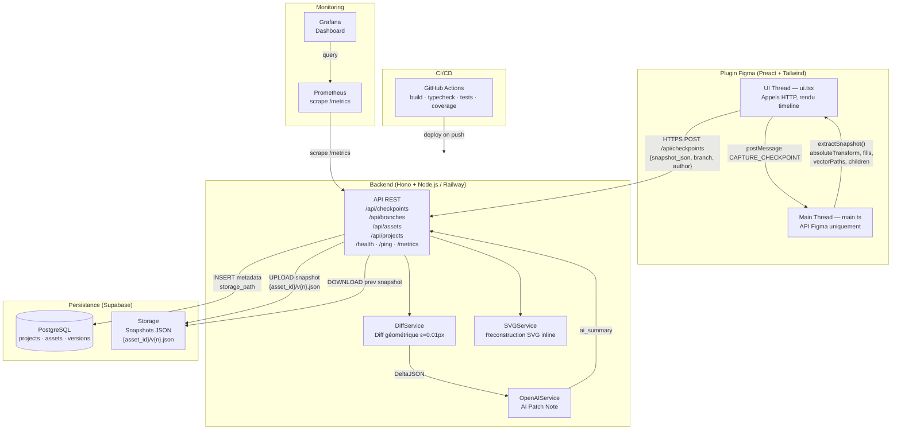
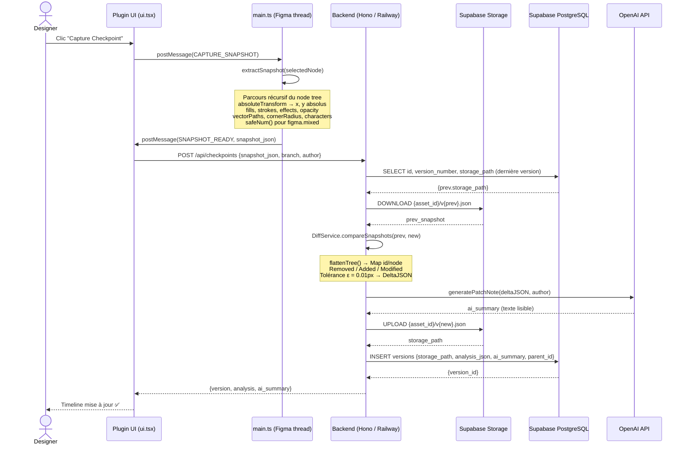
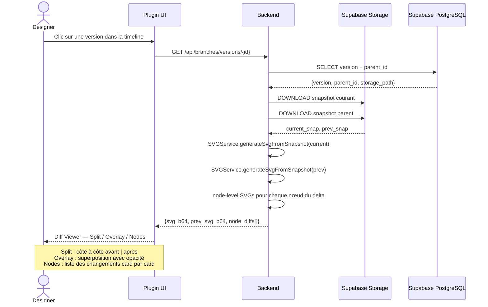
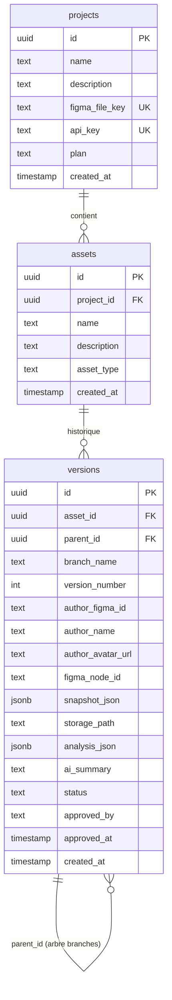
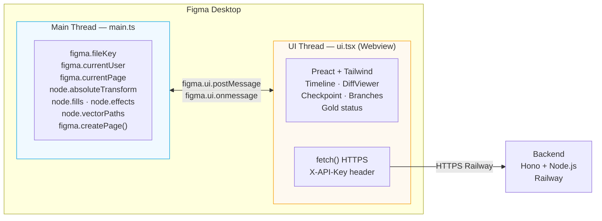
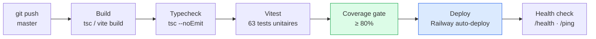

# C1.5 — Architecture Logicielle — Design Guardian

## 1. Architecture globale des microservices

---

## 2. Diagramme de séquence — Capture d'un checkpoint

---

## 3. Diagramme de séquence — Affichage d'un diff

---

## 4. Schéma de la base de données (Supabase / PostgreSQL)

> **Note migration 008** : `snapshot_json` est nullable depuis la migration 008.
> Les nouvelles versions ont `snapshot_json = null` et `storage_path` renseigné.
> Les anciennes versions (pré-migration) conservent leur `snapshot_json` en base.
> `resolveSnapshot()` gère les deux cas de façon transparente.

---

## 5. Architecture double thread Figma

> **Règle critique** : `figma.*` est accessible **uniquement** dans le main thread.
> Les appels HTTP n'existent **uniquement** dans le UI thread. Communication par `postMessage`.

---

## 6. Pipeline CI/CD

