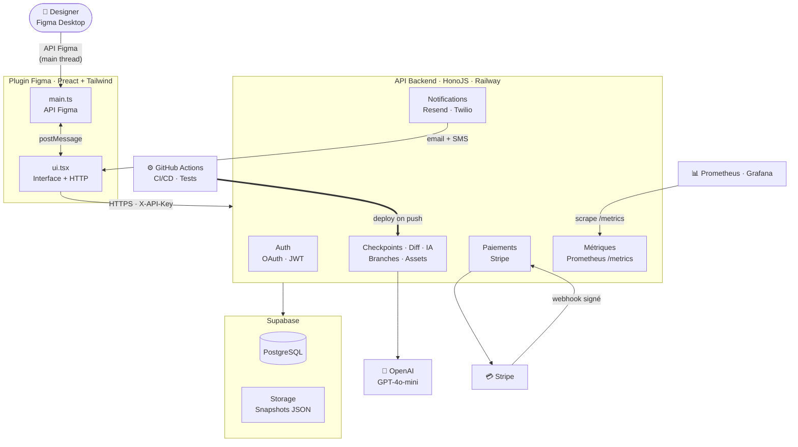
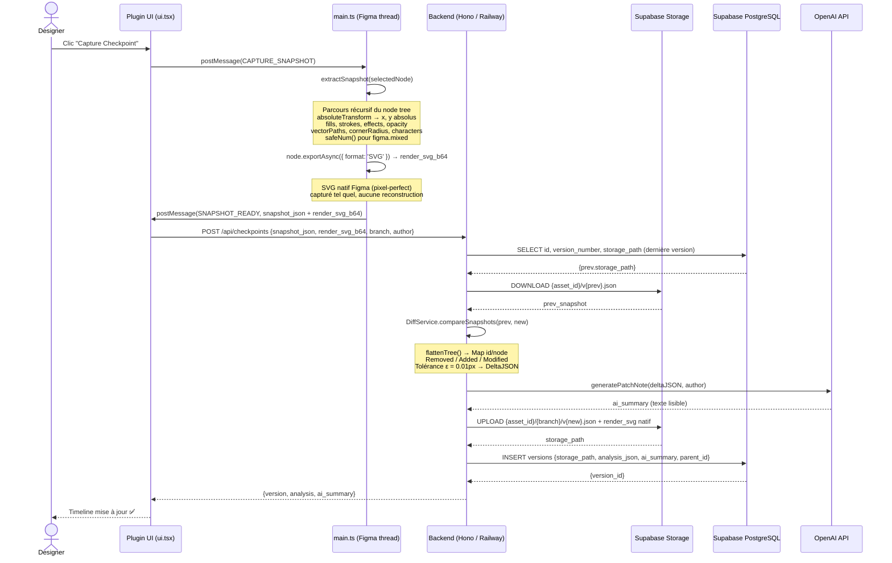
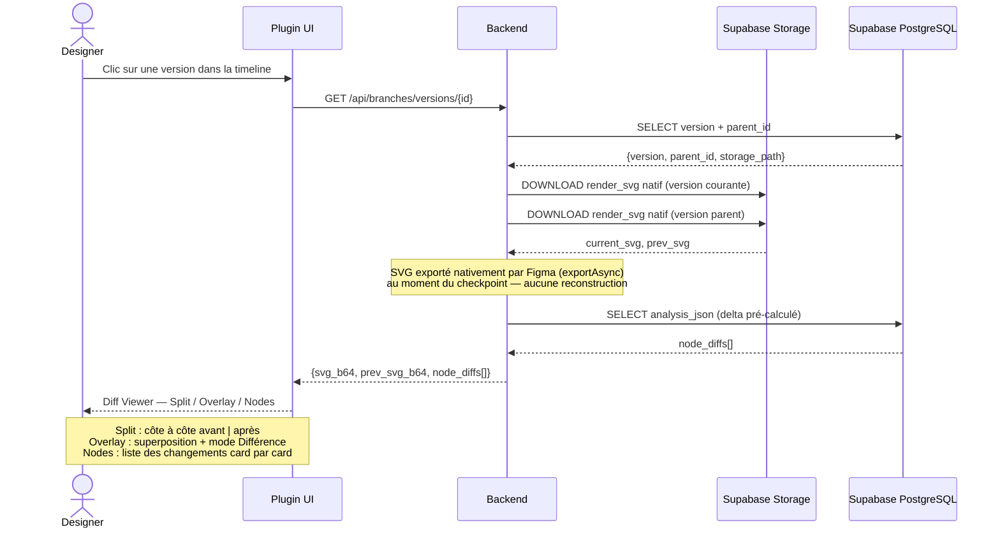
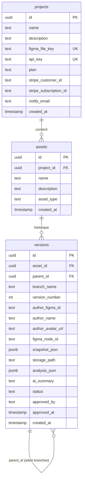
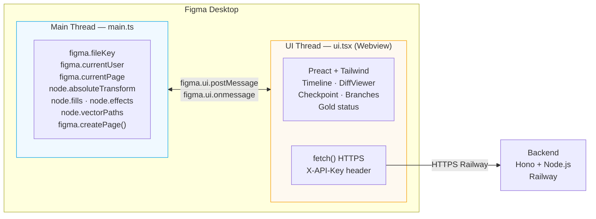
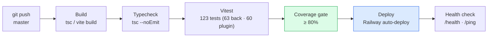

# C1.5 — Architecture Logicielle — Design Guardian

## 1. Architecture globale — Vue macro

> **Légende** — ▭ service / composant · ⬡ service externe · `→` flux de données · `↔` échange bidirectionnel · couleurs = regroupement logique (Plugin / Backend / Data).
>
> **Formalisme** — vue type **C4 « Container »** : un conteneur = une unité déployable, ses services internes = modules. Le **backend Hono = 1 déploiement, 6 services modulaires** (Auth · BDD · Métriques · Notifications · IA · Paiements) — découpage prêt à extraire en microservices si la charge l'exige.
>
> **Sécurité** — Plugin → Backend en `HTTPS` + `X-API-Key` · Auth `JWT / OAuth` · webhooks Stripe signés.
>
> **Éco-conception** — propriétés natives Figma (zéro parsing SVG lourd) · snapshots déportés en Supabase Storage (PostgreSQL allégé) · modèle `gpt-4o-mini` (faible empreinte) · hébergement free tier (ressources minimales).

---

## 1bis. Sécurité · Éco-conception · Extensibilité (vue C1.5 — slide 18)

> Ces 3 blocs couvrent les exigences C1.5 que ni le schéma macro ni les diagrammes de séquence ne montrent : **architecture sécurisée**, **impact environnemental**, **maintenable & extensible**.

### 🔒 Sécurité
- Plugin → Backend en **HTTPS + `X-API-Key`**
- Auth **JWT / OAuth** · token stocké dans `figma.clientStorage`
- Webhooks **Stripe signés** · **RLS Supabase** (row-level security)

### 🌱 Éco-conception
- **Propriétés natives** Figma → zéro parsing SVG lourd (moins de CPU)
- Snapshots déportés en **Supabase Storage** → PostgreSQL allégé
- **`gpt-4o-mini`** (petit modèle) · hébergement **free tier** (pas de sur-provisionnement)

### 🧩 Maintenable & extensible
- **6 services modulaires** (Auth · BDD · Métriques · Notifications · IA · Paiements)
- Monolithe modulaire → **prêt à extraire en microservices** si la charge monte
- **TypeScript bout en bout** · séparation Service / Controller · arbre `parent_id` (CTE récursifs)

> **💳 Roadmap paiement (réponse à l'objection TVA EU)** : **Stripe** pour le MVP (intégration rapide, webhooks signés). Passage à un **Merchant of Record** (Lemon Squeezy / Paddle) prévu pour la **commercialisation**, afin d'**automatiser la TVA EU** — Stripe ne gère pas la TVA en tant que MoR. → Choix MVP assumé, évolution produit anticipée.

---

## 2. Diagramme de séquence — Capture d'un checkpoint

---

## 3. Diagramme de séquence — Affichage d'un diff

---

## 4. Schéma de la base de données (Supabase / PostgreSQL)

> **Note migration 008** : `snapshot_json` est nullable depuis la migration 008.
> Les nouvelles versions ont `snapshot_json = null` et `storage_path` renseigné.
> Les anciennes versions (pré-migration) conservent leur `snapshot_json` en base.
> `resolveSnapshot()` gère les deux cas de façon transparente.

---

## 5. Architecture double thread Figma

> **Règle critique** : `figma.*` est accessible **uniquement** dans le main thread.
> Les appels HTTP n'existent **uniquement** dans le UI thread. Communication par `postMessage`.

---

## 6. Pipeline CI/CD

