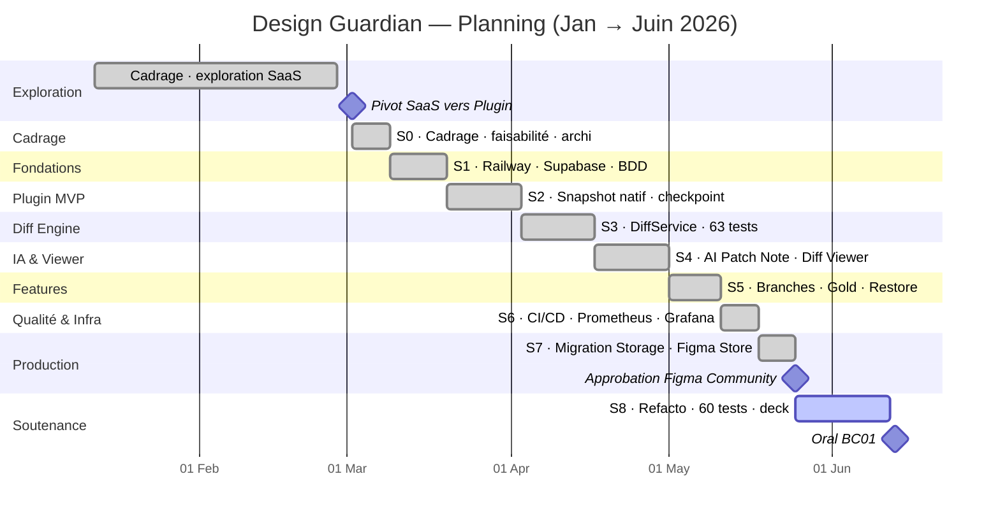
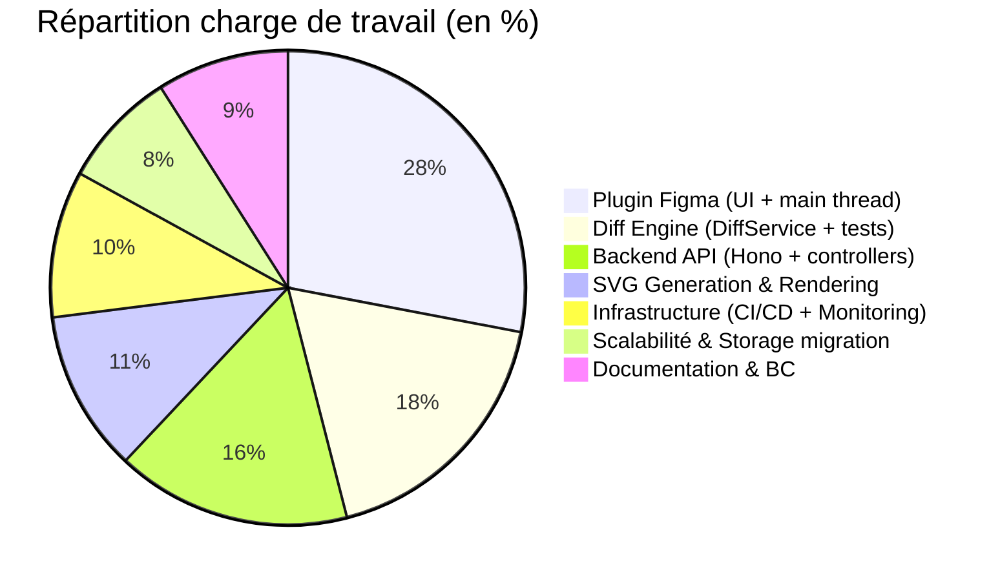
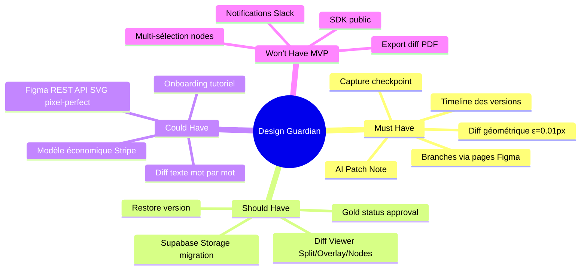

# C1.4.1 — Charge de travail & Planning — Design Guardian

> **Compétence ÉLIMINATOIRE.** Le critère exige : fonctions **hiérarchisées** (principales / secondaires / complémentaires) + charge exprimée en **jour-homme**.
> **Découpage deck = 3 slides, 1 idée énorme par slide** (lisible à 3 m) :
> - **14a — Charge en jour-homme** (le chiffre + barres) ← coche « charge en j-h »
> - **14b — Fonctions hiérarchisées (MoSCoW)** (tableau 4 colonnes) ← coche « fonctions hiérarchisées »
> - **14c — Planning** (Gantt condensé 8 sprints, PNG) ← illustration

---

## Slide 14a — Charge en jour-homme

> **≈ 30 jours-homme** · ~240 h · développeur solo · ~3,5 mois (Mars → Juin 2026, ~2 j/semaine les week-ends)

Répartition par phase (source : `presentation/charts/12-charge-barres.csv`) :

| Phase | Sprints | **Jour-homme** |
|---|---|:---:|
| Diff engine + IA | S3–S4 | **8 j-h** |
| Branches + CI/CD + Monitoring | S5–S6 | **8 j-h** |
| Storage + Store + polish | S7–S8 | **7 j-h** |
| Cadrage + fondations + plugin MVP | S0–S2 | **7 j-h** |
| **Total** | **8 sprints** | **≈ 30 j-h** |

> **Méthode d'estimation** : ~15 semaines × ~2 jours/semaine (week-ends) = ~30 j-h, ventilés par phase selon la complexité (le Diff engine + l'IA concentrent le plus d'effort).
> **Détail par composant** (camembert ci-dessous, version dossier) : Plugin 28 % · Diff 18 % · Backend 16 % · SVG 11 % · Infra 10 % · Doc 9 % · Scalabilité 8 %.

---

## Slide 14c — Planning (Gantt condensé)

> Rendre sur **mermaid.live → export PNG** (ou preview VS Code), puis insérer comme image.

## Vue condensée — 1 barre par sprint (version slide / Canva)

> **Thème sombre pour l'export** : utiliser l'onglet **Config** de mermaid.live (`theme: dark`), puis export PNG ×2.

---

## Décomposition des charges par composant

---

## Slide 14b — Fonctions hiérarchisées (MoSCoW)

> Tableau 4 colonnes à reconstruire **nativement dans Canva** (plus lisible que le mindmap).

| 🟥 MUST (principales) | 🟦 SHOULD (secondaires) | 🟨 COULD (complémentaires) | ⬜ WON'T (hors MVP) |
|---|---|---|---|
| Capture checkpoint | Gold status (approval) | Figma REST API SVG pixel-perfect | SDK public |
| Diff géométrique ε=0,01px | Diff Viewer Split/Overlay/Nodes | Modèle éco. (Stripe) | Export diff PDF |
| AI Patch Note | Restore version | Diff texte mot par mot | Notifications Slack |
| Timeline des versions | Migration Supabase Storage | Onboarding tutoriel | Multi-sélection nodes |
| Branches via pages Figma | | | |

---

## Fonctionnalités — Hiérarchie MoSCoW (mindmap — version dossier)

