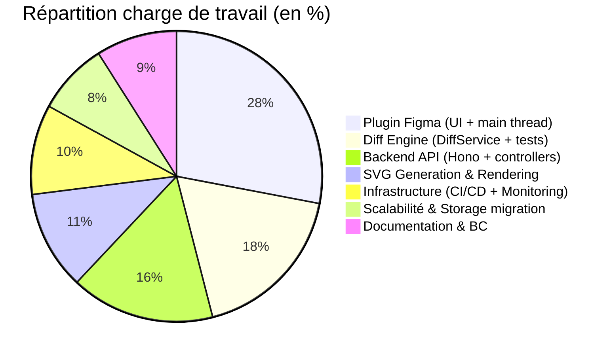
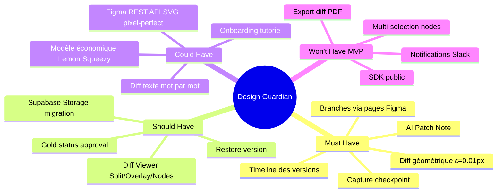

# C1.4.1 — Charge de travail & Planning — Design Guardian

## Diagramme de Gantt — Sprints du projet

```mermaid
gantt
    title Design Guardian — Planning Projet (Oct 2024 → Juin 2026)
    dateFormat YYYY-MM-DD
    excludes weekends

    section Sprint 0 — Cadrage
        Analyse du besoin & contexte           :done, s0a, 2024-10-01, 2024-10-14
        Étude de faisabilité technique         :done, s0b, 2024-10-07, 2024-10-21
        Architecture cible & choix stack       :done, s0c, 2024-10-14, 2024-10-28

    section Sprint 1 — Fondations
        Setup Railway + Supabase               :done, s1a, 2024-10-28, 2024-11-11
        Schéma BDD versions + branches         :done, s1b, 2024-11-04, 2024-11-18
        Plugin scaffold (create-figma-plugin)  :done, s1c, 2024-11-11, 2024-11-25

    section Sprint 2 — Plugin MVP
        Extraction snapshot natif Figma        :done, s2a, 2024-11-25, 2024-12-09
        Abandon exportAsync → propriétés natives :done, s2b, 2024-12-02, 2024-12-16
        Premier checkpoint fonctionnel         :done, s2c, 2024-12-09, 2024-12-23

    section Sprint 3 — Diff Engine
        DiffService algorithme géométrique     :done, s3a, 2025-01-06, 2025-01-27
        63 tests Vitest diff.service           :done, s3b, 2025-01-20, 2025-02-10
        Fix Zod schema (champs silencieux)     :done, s3c, 2025-01-27, 2025-02-03

    section Sprint 4 — IA + Viewer
        AI Patch Note via OpenAI               :done, s4a, 2025-02-10, 2025-02-24
        Diff Viewer Split / Overlay / Nodes    :done, s4b, 2025-02-17, 2025-03-10
        Fix SVG data URI → inline              :done, s4c, 2025-03-03, 2025-03-17

    section Sprint 5 — Features avancées
        Branches isolation via pages Figma     :done, s5a, 2025-03-17, 2025-04-07
        Gold status + Timeline                 :done, s5b, 2025-03-31, 2025-04-21
        Restore version                        :done, s5c, 2025-04-14, 2025-04-28

    section Sprint 6 — Qualité & Infra
        CI/CD GitHub Actions                   :done, s6a, 2025-05-05, 2025-05-19
        Prometheus + Grafana                   :done, s6b, 2025-05-12, 2025-05-26
        Dependabot + CHANGELOG                 :done, s6c, 2025-05-19, 2025-06-02
        Cahier de recettes (63 tests)          :done, s6d, 2025-10-01, 2025-11-15

    section Sprint 7 — Scalabilité & Production
        Migration 008 — Snapshots → Storage    :done, s7a, 2026-04-01, 2026-04-15
        Fix Railway build (tsc dependencies)   :done, s7b, 2026-04-15, 2026-04-20
        Fix isolation figma.fileKey            :done, s7c, 2026-04-20, 2026-04-25
        Soumission Figma Community             :done, s7d, 2026-04-01, 2026-04-10
        Approbation Figma Community            :milestone, figmaok, 2026-05-08, 0d
        Premier utilisateur réel (early adopter) :done, s7e, 2026-05-08, 2026-05-08

    section Sprint 8 — Soutenance BC01/BC03
        Diagrammes architecture Mermaid        :done, s8a, 2026-05-08, 2026-05-09
        Gantt et roadmap                       :active, s8b, 2026-05-09, 2026-05-12
        Parties prenantes & risques            :s8c, 2026-05-12, 2026-05-16
        Backlog MoSCoW + story points          :s8d, 2026-05-12, 2026-05-19
        Deck BC01 — 15-20 slides               :s8e, 2026-05-19, 2026-06-02
        Vidéo Sprint Review 10-15 min          :s8f, 2026-05-26, 2026-06-07
        Préparation oral + répétitions         :s8g, 2026-06-02, 2026-06-07
        Oral BC01 — Soutenance M2              :milestone, sout, 2026-06-13, 0d
```

---

## Décomposition des charges par composant



---

## Fonctionnalités — Hiérarchie MoSCoW


