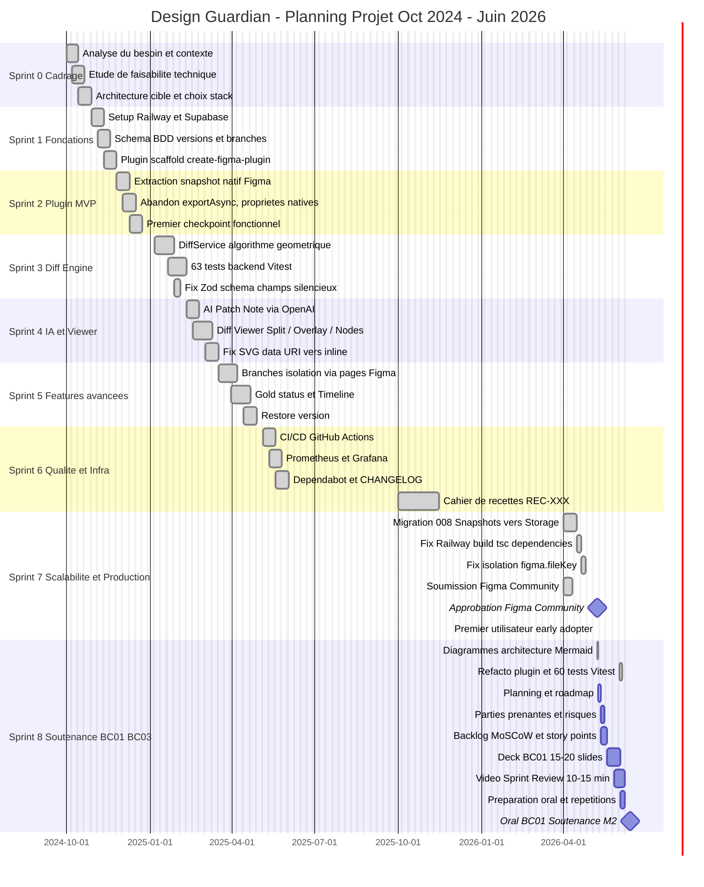
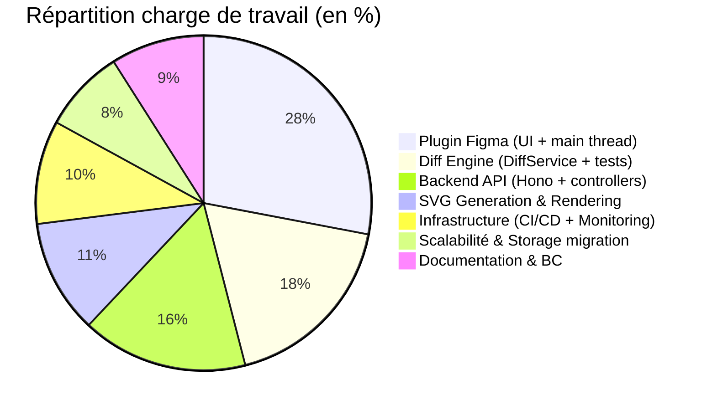
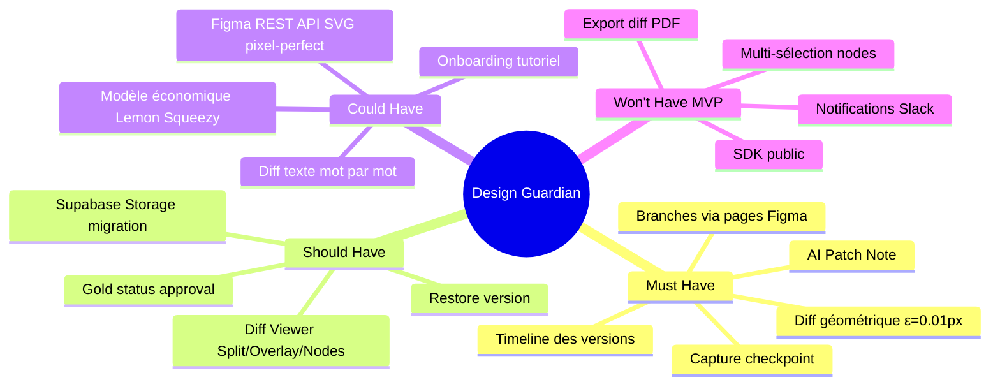

# C1.4.1 — Charge de travail & Planning — Design Guardian

## Diagramme de Gantt — Sprints du projet

---

## Décomposition des charges par composant

---

## Fonctionnalités — Hiérarchie MoSCoW

