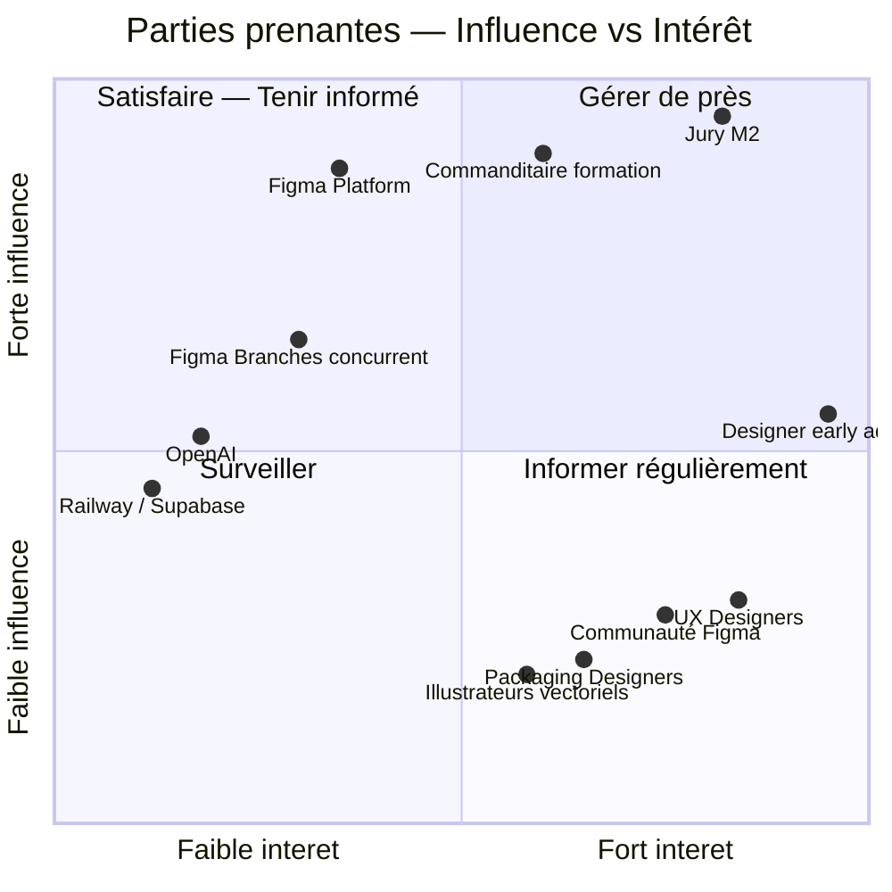
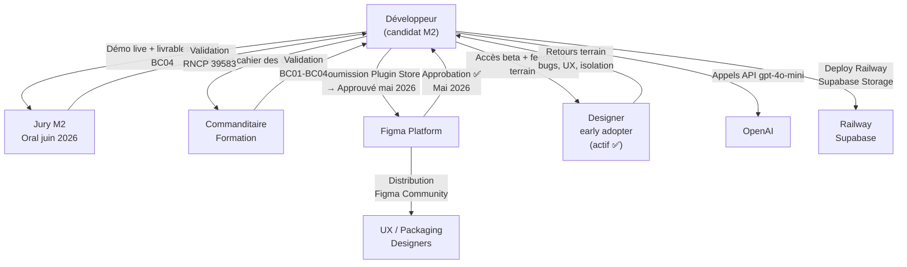

# C1.1.1 — Cartographie des Parties Prenantes — Design Guardian

## Matrice Influence / Intérêt

---

## Description des acteurs

### Quadrant 1 — Gérer de près (Fort intérêt + Forte influence)

| Acteur | Rôle | Attentes | Statut |
|---|---|---|---|
| **Jury M2** | Évalue et valide la certification RNCP 39583 | Produit fonctionnel, documentation complète, démo convaincante | Oral BC01 : 8-19 juin 2026 |
| **Designer early adopter** | Premier utilisateur réel — UX/UI designer indépendant | Plugin stable, diff précis, UX intuitive, isolation correcte | Actif depuis mai 2026 ✅ |

### Quadrant 2 — Satisfaire (Faible intérêt + Forte influence)

| Acteur | Rôle | Attentes | Statut |
|---|---|---|---|
| **Commanditaire formation** | École / organisme de formation — valide le projet M2 | Respect du cahier des charges BC01-BC04, livrables complets | Évaluation en cours |
| **Figma Platform** | Fournit l'API Plugin, contrôle la distribution via le Plugin Store | Respect des règles du Plugin Store, politique réseau (`networkAccess`), pas de violation CGU | Approuvé mai 2026 ✅ |
| **Figma Branches (concurrent)** | Concurrent direct à 45$/mois/user — plan Organization uniquement | — (surveillance concurrentielle) | Design Guardian disponible Free |

### Quadrant 3 — Surveiller (Faible intérêt + Faible influence)

| Acteur | Rôle | Attentes | Statut |
|---|---|---|---|
| **OpenAI** | Fournit l'API LLM pour l'AI Patch Note (`gpt-4o-mini`) | SLA, quotas, pricing stables | API stable — dépendance externe |
| **Railway / Supabase** | Infrastructure hébergement + BDD + Storage | Disponibilité, free tier suffisant pour MVP | Railway green ✅ — Supabase Storage actif ✅ |

### Quadrant 4 — Informer (Fort intérêt + Faible influence)

| Acteur | Rôle | Attentes | Statut |
|---|---|---|---|
| **UX Designers** | Utilisateurs finaux principaux | Diff précis, branches accessibles, prix Free/Pro | Cible principale |
| **Communauté Figma** | Utilisateurs découvrant le plugin via Figma Community | Installation simple, onboarding clair | Disponible publiquement ✅ |
| **Packaging Designers** | Utilisateurs vectoriels spécialisés | Support nodes vectoriels, diff vectorPaths | Cible validée par early adopter |
| **Illustrateurs vectoriels** | Cible élargie identifiée | Diff vectorPaths précis au pixel | Cible secondaire |

---

## Flux de communication

---

## Analyse différentielle vs concurrent Figma Branches

| Critère | Figma Branches | Design Guardian |
|---|---|---|
| Prix | 45 $/mois/user (Organization) | Free (MVP) |
| Diff géométrique | ❌ Snapshot visuel uniquement | ✅ Précision 0.01px |
| Attribution par élément | ❌ | ✅ Author par node |
| AI Patch Note | ❌ | ✅ GPT-4o-mini |
| Gold status | ❌ | ✅ Workflow approval |
| Accès | Plan Organization uniquement | Tout utilisateur Figma |
