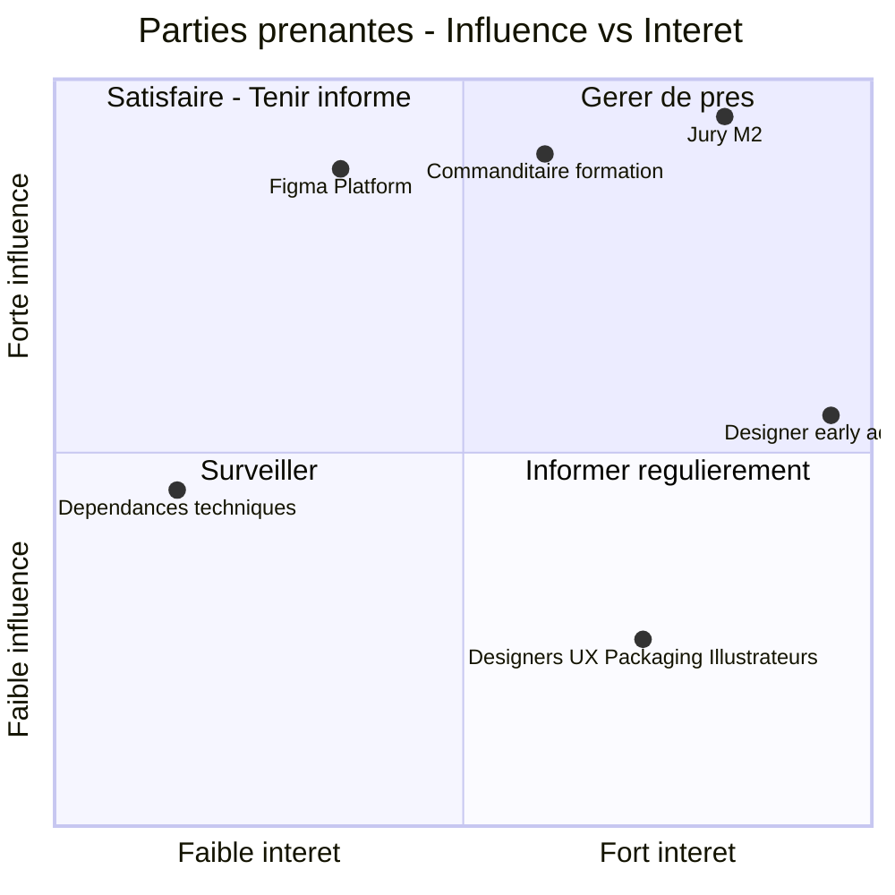
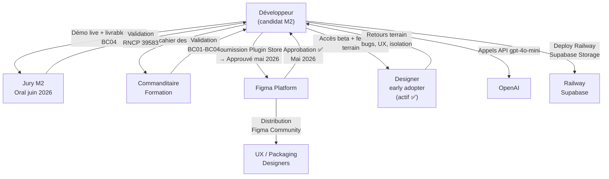

# C1.1.1 — Cartographie des Parties Prenantes — Design Guardian

## Matrice Influence / Intérêt

> **Porteur du projet** : le candidat M2 (rôle **développeur-architecte**) conçoit, développe et déploie le plugin — non plotté car il est l'auteur de la cartographie.
> **6 points** pour la lisibilité : les 3 profils de designers fusionnés en *« Designers »*, et OpenAI · Railway · Supabase en *« Dépendances techniques »*.
> Le concurrent **Figma Branches** n'est **pas** une partie prenante → traité en **C1.3.2 (étude comparative)**.

---

## Description des acteurs

### Quadrant 1 — Gérer de près (Fort intérêt + Forte influence)

| Acteur | Rôle | Attentes | Statut |
|---|---|---|---|
| **Jury M2** | Évalue et valide la certification RNCP 39583 | Produit fonctionnel, documentation complète, démo convaincante | Oral BC01 : 8-19 juin 2026 |
| **Designer early adopter** | Premier utilisateur réel — UX/UI designer indépendant | Plugin stable, diff précis, UX intuitive, isolation correcte | Actif depuis mai 2026 ✅ |

### Quadrant 2 — Satisfaire (Faible intérêt + Forte influence)

| Acteur | Rôle | Attentes | Statut |
|---|---|---|---|
| **Commanditaire formation** | École / organisme de formation — valide le projet M2 | Respect du cahier des charges BC01-BC04, livrables complets | Évaluation en cours |
| **Figma Platform** | Fournit l'API Plugin, contrôle la distribution via le Plugin Store | Respect des règles du Plugin Store, politique réseau (`networkAccess`), pas de violation CGU | Approuvé mai 2026 ✅ |

### Quadrant 3 — Surveiller (Faible intérêt + Faible influence)

| Acteur | Rôle | Attentes | Statut |
|---|---|---|---|
| **Dépendances techniques** (OpenAI · Railway · Supabase) | API LLM (`gpt-4o-mini`) + hébergement + BDD/Storage | SLA, quotas, pricing stables · free tier suffisant pour le MVP | API stable ✅ · Railway green ✅ · Supabase actif ✅ |

### Quadrant 4 — Informer (Fort intérêt + Faible influence)

| Acteur | Rôle | Attentes | Statut |
|---|---|---|---|
| **Designers** (UX/UI · packaging · illustrateurs vectoriels) | Utilisateurs finaux — caractéristiques détaillées ci-dessous | Diff précis au pixel, branches accessibles, prix Free/Pro | Cible principale, validée par l'early adopter |

---

## Rôles & caractéristiques des futurs utilisateurs

> La matrice **positionne** les acteurs ; ce tableau détaille **rôle + niveau d'implication + caractéristiques** — la partie de C1.1.1 que le nuage de points ne montre pas. **Slide compagnon de la matrice.**

### Rôle & niveau d'implication (synthèse)

| Acteur | Rôle | Niveau d'implication |
|---|---|---|
| **Jury M2** | Évalue et valide la certification | Gérer de près |
| **Commanditaire formation** | Valide le projet M2 (cahier des charges) | Satisfaire |
| **Designer early adopter** | 1er utilisateur réel — feedback terrain | Gérer de près |
| **Figma Platform** | Fournit l'API Plugin + distribution Store | Satisfaire |
| **Designers** (finaux) | Utilisent le plugin au quotidien | Informer |
| **Dépendances techniques** | Infra + IA (OpenAI/Railway/Supabase) | Surveiller |

### Caractéristiques des utilisateurs finaux (personas)

| Profil | Contexte d'usage | Caractéristiques | Besoin clé |
|---|---|---|---|
| **UX/UI designer** *(cible principale)* | Équipe, fichiers Figma partagés, itérations rapides | Non-développeur · vit **dans Figma** · collabore à plusieurs | Savoir **qui a changé quoi**, branches accessibles |
| **Packaging designer** | Print / packaging vectoriel, nodes complexes | Exigence de précision matérielle | Diff sur **`vectorPaths`** |
| **Illustrateur vectoriel** | Créations vectorielles détaillées | Sensibilité géométrique forte | Précision **0,01px** |
| **Brand / design system** | Cohérence de marque, gouvernance visuelle | Besoin de validation/contrôle | Historique + **Gold status** (approval) |

> **Profil commun** : **non-développeur**, travaille **dans Figma**, découvre via **Figma Community**.
> → C'est ce qui justifie un **plugin natif** (friction zéro) plutôt qu'un SaaS externe.

---

## Flux de communication

---

## Analyse différentielle vs concurrent Figma Branches

| Critère | Figma Branches | Design Guardian |
|---|---|---|
| Prix | 45 $/mois/user (Organization) | Free (MVP) |
| Diff géométrique | ❌ Snapshot visuel uniquement | ✅ Précision 0.01px |
| Attribution par élément | ❌ | ✅ Author par node |
| AI Patch Note | ❌ | ✅ GPT-4o-mini |
| Gold status | ❌ | ✅ Workflow approval |
| Accès | Plan Organization uniquement | Tout utilisateur Figma |
