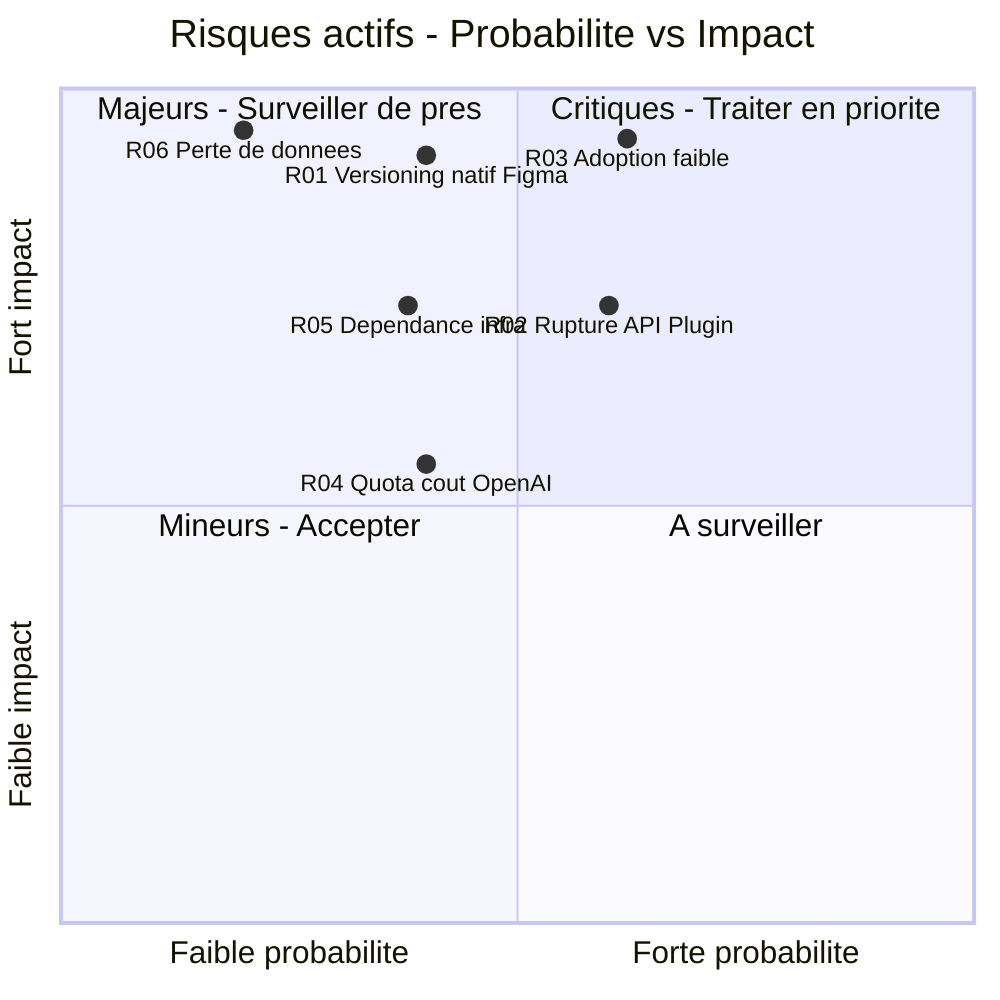
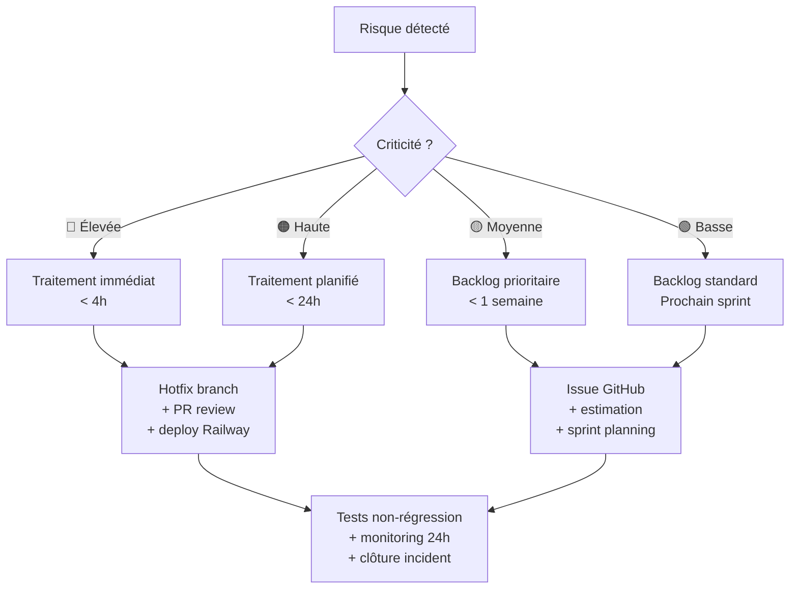

# C1.2.3 — Cartographie des Risques — Design Guardian

## Matrice Probabilité / Impact (risques actifs)

> Échelle 1-5 normalisée sur l'axe. **Criticité = Probabilité × Impact.** Chaque risque occupe une case distincte (pas de superposition).
> R03 (adoption, 3 × 5 = 15) est le risque le plus critique — devant les risques techniques.

---

## Référentiel des risques actifs

| ID | Risque | Probabilité | Impact | Criticité | Mitigation |
|----|--------|:-----------:|:------:|-----------|------------|
| R03 | Adoption faible au lancement | 3 | 5 | 🔴 Élevée (15) | Early adopter actif (mai 2026) · plugin public Figma Community · onboarding à venir |
| R02 | Rupture / changement de l'API Plugin Figma | 3 | 4 | 🔴 Élevée (12) | APIs stables documentées uniquement · veille active du changelog Figma (déjà vécu : `exportAsync`, sprint 2) |
| R01 | Figma sort un versioning natif | 2 | 5 | 🔴 Élevée (10) | Différenciation prix (Branches 45 $/mois/user vs DG Free) · diff 0,01px · AI Patch Note |
| R05 | Dépendance infra (Railway / Supabase) | 2 | 4 | 🟠 Haute (8) | Health checks `/health` · `/ping` + UptimeRobot 5 min · rollback Railway en 1 clic |
| R04 | Quota / coût OpenAI dépassé | 2 | 3 | 🟡 Moyenne (6) | Rate limiting backend · fallback `ai_summary = null` si quota atteint |
| R06 | Perte de données (snapshot manquant) | 1 | 5 | 🟡 Moyenne (5) | Sauvegarde Storage + INSERT atomique · `snapshot_json` nullable géré par `resolveSnapshot()` |

> **Indicateurs de contrôle** : health checks `/health` et `/ping` · monitoring Grafana · taux d'erreur API · latence des endpoints · couverture de tests ≥ 80 %.

---

## Workflow de traitement d'un risque

---

## Risques matérialisés et résolus

Ces risques se sont concrétisés en cours de projet et ont été traités — détail dans `DEBLOCAGES.md`.

| ID | Risque matérialisé | Sprint | Impact réel | Résolution | Commit |
|---|---|---|---|---|---|
| R-M01 | `exportAsync` indisponible — plugin ne chargeait pas | Sprint 2 | Bloquant | Abandon → propriétés natives Figma (`absoluteTransform`, `fills`, `vectorPaths`) | `2076ca8` |
| R-M02 | Zod schema supprimait les champs silencieusement | Sprint 3 | Textes et effets jamais capturés | Ajout des champs manquants (`characters`, `effects`, `rotation`, `visible`) | `a0126b0` |
| R-M03 | data URI trop grande pour le webview Figma | Sprint 4 | Frame view inutilisable | Remplacement `` par `dangerouslySetInnerHTML` + `atob()` | `da85c8d` |
| R-M04 | `figma.mixed` Symbol non sérialisable | Sprint 4 | Crash sur nodes complexes | Guards `safeNum()` / `safeStr()` | `14df015` |
| R-M05 | Branches = labels sans isolation réelle | Sprint 5 | Toutes les branches écrasaient le même canvas | Branches = pages Figma dédiées `dg/branchName` | `9f6da16` |
| R-M06 | `snapshot_json` dans PostgreSQL — saturation à l'échelle | Sprint 7 | 200-600 KB/commit en base, non scalable | Migration 008 — Supabase Storage bucket `snapshots` | `c354c46` |
| R-M07 | `figma.fileKey` null → collision de projets inter-utilisateurs | Sprint 7 | Tous les fichiers locaux partageaient le même projet | Blocage explicite avec message d'erreur si `fileKey` absent | `1075f02` |
| R-M08 | Supabase free tier pause → backend injoignable | Sprint 7 | Plugin inaccessible, rejet Figma Community | Endpoint `/ping` + UptimeRobot 5min — base maintenue active | `8403ca0` |
| R04 | Plugin Store refus Figma | Sprint 7 | Délai d'un mois, premier rejet | Correction manifest `networkAccess`, fix Railway build | Approuvé mai 2026 ✅ |
