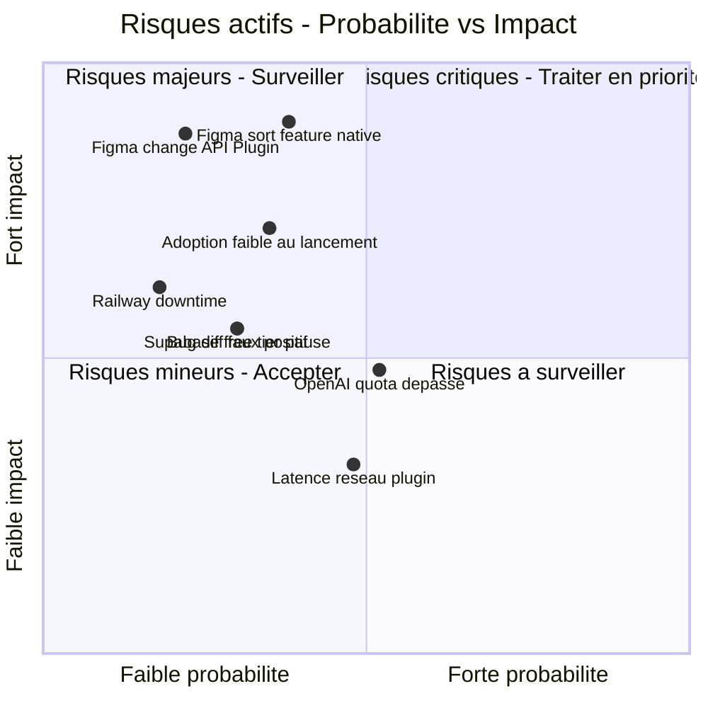
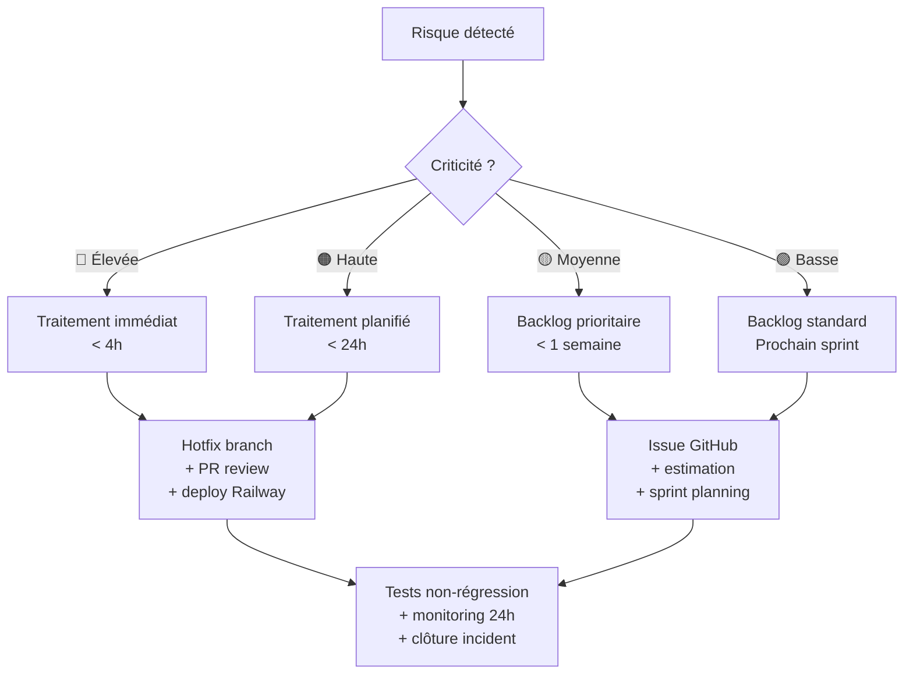

# C1.2.3 — Cartographie des Risques — Design Guardian

## Matrice Probabilité / Impact (risques actifs)

---

## Référentiel des risques actifs

| ID | Risque | Probabilité | Impact | Criticité | Mitigation |
|---|---|---|---|---|---|
| R01 | Figma sort une feature native de versioning | Moyenne | Critique | 🔴 Élevée | Différenciation prix (Branches = 45$/mois/user, DG = Free) + précision 0.01px + AI Patch Note |
| R02 | Figma modifie/supprime l'API Plugin | Faible | Critique | 🔴 Élevée | Utiliser uniquement les APIs stables documentées, surveiller changelogs Figma |
| R03 | Adoption faible au lancement | Moyenne | Majeur | 🟠 Haute | Early adopter actif depuis mai 2026, plugin public Figma Community, onboarding à venir |
| R05 | Bug diff faux positif | Faible | Majeur | 🟠 Haute | 123 tests Vitest (63 back · 60 plugin), tolérance ε=0.01px — risque réduit post-tests |
| R06 | OpenAI quota dépassé / coût | Moyenne | Modéré | 🟡 Moyenne | Rate limiting backend, fallback `ai_summary = null` si quota dépassé |
| R07 | Railway downtime | Faible | Modéré | 🟡 Moyenne | Health checks `/health`, monitoring Grafana, rollback Railway en 1 clic |
| R08 | Supabase free tier pause automatique | Moyenne | Modéré | 🟡 Moyenne | Endpoint `/ping` + UptimeRobot toutes les 5min pour maintenir la base active |
| R09 | Latence réseau plugin | Moyenne | Faible | 🟢 Basse | Feedback visuel loading, Supabase Storage réduit la taille des INSERTs PostgreSQL |

---

## Workflow de traitement d'un risque

---

## Risques matérialisés et résolus

Ces risques se sont concrétisés en cours de projet et ont été traités — détail dans `DEBLOCAGES.md`.

| ID | Risque matérialisé | Sprint | Impact réel | Résolution | Commit |
|---|---|---|---|---|---|
| R-M01 | `exportAsync` indisponible — plugin ne chargeait pas | Sprint 2 | Bloquant | Abandon → propriétés natives Figma (`absoluteTransform`, `fills`, `vectorPaths`) | `2076ca8` |
| R-M02 | Zod schema supprimait les champs silencieusement | Sprint 3 | Textes et effets jamais capturés | Ajout des champs manquants (`characters`, `effects`, `rotation`, `visible`) | `a0126b0` |
| R-M03 | data URI trop grande pour le webview Figma | Sprint 4 | Frame view inutilisable | Remplacement `` par `dangerouslySetInnerHTML` + `atob()` | `da85c8d` |
| R-M04 | `figma.mixed` Symbol non sérialisable | Sprint 4 | Crash sur nodes complexes | Guards `safeNum()` / `safeStr()` | `14df015` |
| R-M05 | Branches = labels sans isolation réelle | Sprint 5 | Toutes les branches écrasaient le même canvas | Branches = pages Figma dédiées `dg/branchName` | `9f6da16` |
| R-M06 | `snapshot_json` dans PostgreSQL — saturation à l'échelle | Sprint 7 | 200-600 KB/commit en base, non scalable | Migration 008 — Supabase Storage bucket `snapshots` | `c354c46` |
| R-M07 | `figma.fileKey` null → collision de projets inter-utilisateurs | Sprint 7 | Tous les fichiers locaux partageaient le même projet | Blocage explicite avec message d'erreur si `fileKey` absent | `1075f02` |
| R-M08 | Supabase free tier pause → backend injoignable | Sprint 7 | Plugin inaccessible, rejet Figma Community | Endpoint `/ping` + UptimeRobot 5min — base maintenue active | `8403ca0` |
| R04 | Plugin Store refus Figma | Sprint 7 | Délai d'un mois, premier rejet | Correction manifest `networkAccess`, fix Railway build | Approuvé mai 2026 ✅ |
