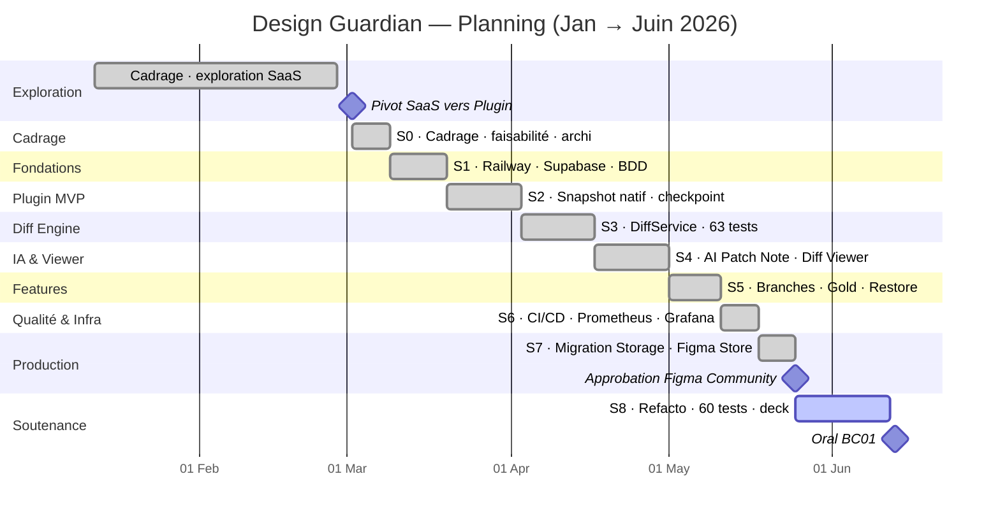

# Gantt condensé — Design Guardian (preview VS Code → PNG)

> Aperçu : `Ctrl+Shift+V` (extension « Markdown Preview Mermaid Support »).
> Export PNG : clic droit sur le diagramme dans l'aperçu, ou via mermaid.live.

