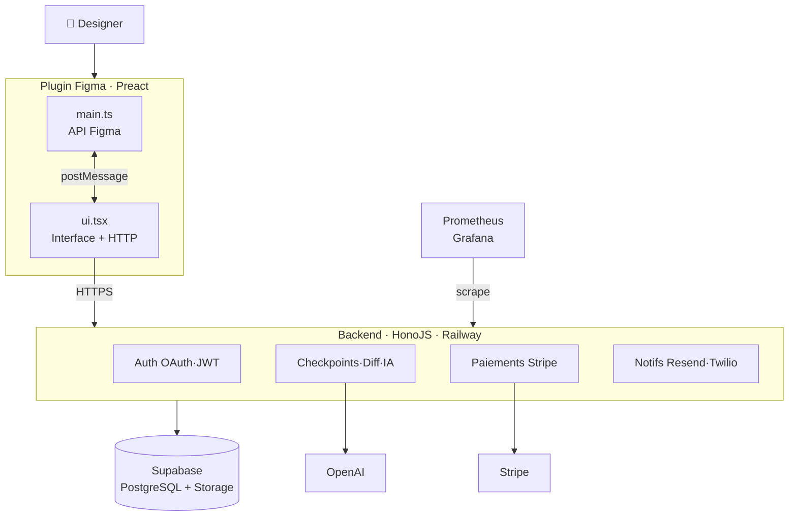

<div class="h-full flex flex-col justify-center">
  <div class="flex items-center gap-4 mb-8">
    <div class="dg-logo lg">DG</div>
    <div>
      <div class="tag tag-purple mb-2">Plugin Figma · M2 Expert Développement Logiciel</div>
    </div>
  </div>

  <h1 class="text-6xl mb-4">Design Guardian</h1>
  <p class="text-xl" style="color: #9ca3af; max-width: 520px; line-height: 1.5">
    Le contrôle de version pour les designers Figma.<br>
    Précision 0.01px. Attribution par élément. IA embarquée.
  </p>

  <div class="flex items-center gap-6 mt-12">
    <div style="color: #4b5563; font-size: 0.8rem">Hardi Tabuna</div>
    <div style="color: #1f2937">·</div>
    <div style="color: #4b5563; font-size: 0.8rem">2026</div>
    <div style="color: #1f2937">·</div>
    <div style="color: #4b5563; font-size: 0.8rem">design-guardian.up.railway.app</div>
  </div>
</div>

---
layout: center
---

<h1 class="text-center mb-2">Le problème</h1>
<p class="text-center mb-10" style="color: #6b7280">Figma sait <em>que</em> tu as sauvegardé. Il ne sait pas <em>quoi</em>, <em>où</em>, ni <em>pourquoi</em>.</p>

<div class="grid grid-cols-3 gap-5">
  <div class="card">
    <div class="font-semibold text-white mb-2">Figma Version History</div>
    <div class="text-sm" style="color: #9ca3af">Capture des snapshots visuels. Impossible de savoir <strong>quel élément</strong> a changé ni de quel montant.</div>
  </div>
  <div class="card">
    <div class="font-semibold text-white mb-2">Attribution fantôme</div>
    <div class="text-sm" style="color: #9ca3af">Dans un fichier partagé à 5 designers, <strong>impossible</strong> de savoir qui a modifié quoi et quand.</div>
  </div>
  <div class="card">
    <div class="font-semibold text-white mb-2">Figma Branches = 45€/mois/user</div>
    <div class="text-sm" style="color: #9ca3af">Réservé au plan Organization. Inaccessible pour les <strong>freelances et petites équipes</strong>.</div>
  </div>
</div>

---
layout: center
---

<h1 class="text-center mb-10">La solution</h1>

<div class="grid grid-cols-2 gap-4 max-w-2xl mx-auto">
  <div class="card">
    <div class="font-semibold text-white text-sm mb-1">Diff géométrique 0.01px</div>
    <div class="text-xs" style="color: #9ca3af">Comparaison nœud par nœud via les propriétés natives Figma</div>
  </div>
  <div class="card">
    <div class="font-semibold text-white text-sm mb-1">AI Patch Notes (GPT-4o-mini)</div>
    <div class="text-xs" style="color: #9ca3af">Changelog en langage naturel généré à chaque checkpoint</div>
  </div>
  <div class="card">
    <div class="font-semibold text-white text-sm mb-1">Branches de design</div>
    <div class="text-xs" style="color: #9ca3af">Workflow Git-like : main, feat/redesign, fix/nav — disponible Free</div>
  </div>
  <div class="card">
    <div class="font-semibold text-white text-sm mb-1">Restauration sur canvas</div>
    <div class="text-xs" style="color: #9ca3af">Apply to Figma — restaure une version directement dans le fichier</div>
  </div>
  <div class="card">
    <div class="font-semibold text-white text-sm mb-1">Statut Gold</div>
    <div class="text-xs" style="color: #9ca3af">Marque une version comme référence officielle du projet</div>
  </div>
  <div class="card">
    <div class="font-semibold text-white text-sm mb-1">Split / Overlay / Nodes</div>
    <div class="text-xs" style="color: #9ca3af">3 modes de visualisation du diff : côte-à-côte, superposition, liste</div>
  </div>
</div>

---
layout: two-cols
---

<h1>Architecture</h1>
<p style="color: #6b7280; font-size: 0.85rem; margin-bottom: 1rem">6 microservices · Plugin Figma · Supabase · Railway</p>



<a class="open-diagram" href="/architecture.html" target="_blank">
  🔍 Explorer en interactif →
</a>

::right::

<div class="flex flex-col gap-3 pl-8 pt-12">
  <div v-click class="card">
    <div class="tag tag-purple mb-2">Double thread Figma</div>
    <div class="text-xs" style="color: #9ca3af"><strong>main.ts</strong> : API Figma uniquement (absoluteTransform, fills, vectorPaths)<br><strong>ui.tsx</strong> : interface + appels HTTPS</div>
  </div>
  <div v-click class="card">
    <div class="tag tag-blue mb-2">Diff engine</div>
    <div class="text-xs" style="color: #9ca3af">Propriétés natives Figma → DeltaJSON. Tolérance ε = 0.01px. Pas de parsing SVG.</div>
  </div>
  <div v-click class="card">
    <div class="tag tag-green mb-2">Persistance</div>
    <div class="text-xs" style="color: #9ca3af">Snapshots JSON → Supabase Storage. Métadonnées → PostgreSQL. CTE récursifs pour l'arbre de branches.</div>
  </div>
</div>

---
layout: center
---

<h1 class="text-center mb-8">Parties prenantes</h1>

<div class="grid grid-cols-2 gap-5 max-w-3xl mx-auto">
  <div class="card" style="border-color:rgba(239,68,68,0.3);background:rgba(239,68,68,0.05)">
    <div class="tag" style="background:rgba(239,68,68,0.15);color:#f87171;margin-bottom:0.5rem">Gérer de près — Q1</div>
    <div class="flex flex-col gap-1.5">
      <div class="text-sm"><span class="font-semibold text-white">Jury M2</span> <span style="color:#9ca3af">— valide RNCP 39583 · oral juin 2026</span></div>
      <div class="text-sm"><span class="font-semibold text-white">Early adopter ✅</span> <span style="color:#9ca3af">— designer UX/UI indépendant · actif mai 2026</span></div>
    </div>
  </div>
  <div class="card" style="border-color:rgba(147,51,234,0.3);background:rgba(147,51,234,0.05)">
    <div class="tag tag-purple mb-2">Satisfaire — Q2</div>
    <div class="flex flex-col gap-1.5">
      <div class="text-sm"><span class="font-semibold text-white">Commanditaire formation</span> <span style="color:#9ca3af">— livrables BC01–BC04</span></div>
      <div class="text-sm"><span class="font-semibold text-white">Figma Platform</span> <span style="color:#9ca3af">— Plugin Store · approuvé mai 2026 ✅</span></div>
      <div class="text-sm"><span class="font-semibold text-white">Figma Branches</span> <span style="color:#9ca3af">— concurrent à 45 $/mois/user</span></div>
    </div>
  </div>
  <div class="card">
    <div class="tag tag-amber mb-2">Informer — Q4</div>
    <div class="flex flex-col gap-1.5">
      <div class="text-sm"><span class="font-semibold text-white">UX / Packaging Designers</span> <span style="color:#9ca3af">— utilisateurs finaux</span></div>
      <div class="text-sm"><span class="font-semibold text-white">Communauté Figma</span> <span style="color:#9ca3af">— découverte via Plugin Store</span></div>
    </div>
  </div>
  <div class="card">
    <div class="tag tag-blue mb-2">Surveiller — Q3</div>
    <div class="flex flex-col gap-1.5">
      <div class="text-sm"><span class="font-semibold text-white">OpenAI</span> <span style="color:#9ca3af">— API GPT-4o-mini · quotas</span></div>
      <div class="text-sm"><span class="font-semibold text-white">Railway / Supabase</span> <span style="color:#9ca3af">— infrastructure hébergement</span></div>
    </div>
  </div>
</div>

<div class="mt-4 p-3 rounded-lg text-center" style="background:rgba(34,197,94,0.08);border:1px solid rgba(34,197,94,0.2)">
  <span class="text-sm" style="color:#4ade80">✦ Early adopter actif — designer professionnel avec sa propre entreprise · feedback terrain CHECK_04 intégré dans le produit</span>
</div>

---
layout: center
---

<h1 class="text-center mb-2">IA — AI Patch Notes</h1>
<p class="text-center mb-8" style="color: #6b7280">Le delta de propriétés Figma est envoyé à GPT-4o-mini qui retourne une note en langage naturel</p>

<div class="grid grid-cols-2 gap-6 max-w-3xl mx-auto">
  <div>
    <div class="tag tag-amber mb-3">Input — DeltaJSON</div>
    ```json
    {
      "modified": [{
        "nodeName": "Button / Primary",
        "changes": [
          { "property": "fill.color",
            "delta": "#6366F1 → #9333EA" },
          { "property": "cornerRadius",
            "delta": "8px → 12px" }
        ]
      }],
      "added": [{ "nodeName": "Icon / Arrow" }],
      "totalChanges": 3
    }
    ```
  </div>
  <div>
    <div class="tag tag-purple mb-3">Output — AI Patch Note</div>
    <div class="card" style="font-size: 0.82rem; line-height: 1.7; color: #e5e7eb">
      <span style="color: #a855f7; font-weight: 600">Hardi</span> a mis à jour le composant <strong>Button / Primary</strong> : couleur de fond passée de l'indigo (#6366F1) au violet (#9333EA), arrondi augmenté de 8 à 12px pour un aspect plus moderne. Une icône de navigation (<strong>Icon / Arrow</strong>) a été ajoutée au bouton.
    </div>
    <div class="mt-3 text-xs" style="color: #4b5563">Modèle : gpt-4o-mini · ~0.001$ / checkpoint</div>
  </div>
</div>

---

<h1 class="mb-2">Diff viewer — 3 modes</h1>

<div class="grid grid-cols-3 gap-4 mt-6">
  <div class="card card-accent">
    <div class="tag tag-purple mb-3">Split</div>
    <div class="text-sm font-semibold text-white mb-2">Côte à côte</div>
    <div style="display:flex; gap: 4px; height: 80px; margin-bottom: 0.75rem">
      <div style="flex:1; background: #1f2937; border-radius: 6px; border: 1px solid #374151; display:flex; align-items:center; justify-content:center">
        <div style="font-size: 0.65rem; color: #6b7280">v3 — avant</div>
      </div>
      <div style="flex:1; background: rgba(147,51,234,0.1); border-radius: 6px; border: 1px solid rgba(147,51,234,0.4); display:flex; align-items:center; justify-content:center">
        <div style="font-size: 0.65rem; color: #a855f7">v4 — après</div>
      </div>
    </div>
    <div class="text-xs" style="color: #9ca3af">Comparaison visuelle directe avant / après en SVG vectoriel</div>
  </div>

  <div class="card">
    <div class="tag tag-blue mb-3">Overlay</div>
    <div class="text-sm font-semibold text-white mb-2">Superposition</div>
    <div style="height: 80px; background: #1f2937; border-radius: 6px; border: 1px solid #374151; margin-bottom: 0.75rem; position: relative; display:flex; align-items:center; justify-content:center">
      <div style="position:absolute; inset: 8px; background: rgba(147,51,234,0.2); border-radius: 4px; display:flex; align-items:center; justify-content:center">
        <div style="font-size: 0.65rem; color: #a855f7">opacity slider ←→</div>
      </div>
    </div>
    <div class="text-xs" style="color: #9ca3af">Glissière d'opacité pour fondre entre les deux états</div>
  </div>

  <div class="card">
    <div class="tag tag-green mb-3">Nodes</div>
    <div class="text-sm font-semibold text-white mb-2">Carte par nœud</div>
    <div style="height: 80px; overflow: hidden; margin-bottom: 0.75rem; display: flex; flex-direction: column; gap: 4px">
      <div style="background: rgba(34,197,94,0.08); border: 1px solid rgba(34,197,94,0.2); border-radius: 6px; padding: 4px 8px; font-size: 0.6rem; color: #4ade80">+ Icon / Arrow — ajout</div>
      <div style="background: rgba(147,51,234,0.08); border: 1px solid rgba(147,51,234,0.2); border-radius: 6px; padding: 4px 8px; font-size: 0.6rem; color: #c084fc">~ Button / Primary — modifié</div>
      <div style="background: rgba(239,68,68,0.08); border: 1px solid rgba(239,68,68,0.2); border-radius: 6px; padding: 4px 8px; font-size: 0.6rem; color: #f87171">− Divider — supprimé</div>
    </div>
    <div class="text-xs" style="color: #9ca3af">Liste des nœuds modifiés avec miniature SVG avant/après</div>
  </div>
</div>

<div class="mt-5 p-3 rounded-lg flex items-center gap-3" style="background: rgba(147,51,234,0.08); border: 1px solid rgba(147,51,234,0.2)">
  <span style="color: #a855f7">🎨</span>
  <span class="text-xs" style="color: #9ca3af">SVG exporté nativement par Figma (<code>exportAsync</code>) — <strong style="color: #e5e7eb">rendu pixel-perfect, aucune reconstruction, identique à ce que Figma affiche</strong></span>
</div>

---
layout: center
---

<h1 class="text-center mb-10">Modèle économique</h1>

<div class="grid grid-cols-3 gap-5 max-w-2xl mx-auto">
  <div class="plan-card">
    <div class="plan-name">Free</div>
    <div class="plan-price">0€ <span>/ mois</span></div>
    <hr style="border-color: #1f2937; margin: 0.5rem 0">
    <div class="plan-feature">10 checkpoints par projet</div>
    <div class="plan-feature">Timeline + Diff viewer</div>
    <div class="plan-feature">AI Patch Notes</div>
    <div class="plan-feature">1 branche (main)</div>
  </div>

  <div class="plan-card featured">
    <div class="tag tag-purple mb-1">Le plus populaire</div>
    <div class="plan-name">Pro</div>
    <div class="plan-price">12€ <span>/ mois</span></div>
    <hr style="border-color: #374151; margin: 0.5rem 0">
    <div class="plan-feature">Checkpoints illimités</div>
    <div class="plan-feature">Branches illimitées</div>
    <div class="plan-feature">Statut Gold + Review</div>
    <div class="plan-feature">Historique complet</div>
    <div class="plan-feature">Apply to Figma (restauration)</div>
  </div>

  <div class="plan-card">
    <div class="plan-name">Team</div>
    <div class="plan-price">39€ <span>/ mois</span></div>
    <hr style="border-color: #1f2937; margin: 0.5rem 0">
    <div class="plan-feature">Tout Pro inclus</div>
    <div class="plan-feature">Multi-designers</div>
    <div class="plan-feature">Attribution par membre</div>
    <div class="plan-feature">Notifications email + SMS</div>
    <div class="plan-feature">Support prioritaire</div>
  </div>
</div>

<div class="flex justify-center mt-6">
  <div class="text-xs" style="color: #4b5563">Paiement via Stripe · Facturation mensuelle ou annuelle (−20%) · Webhooks en temps réel</div>
</div>

---

<h1 class="mb-6">6 microservices backend</h1>

<div class="grid grid-cols-3 gap-4">
  <div class="card">
    <div class="flex items-center gap-2 mb-2">
      <span class="tag tag-purple">A</span>
      <span class="font-semibold text-white text-sm">Auth</span>
    </div>
    <div class="text-xs" style="color: #9ca3af">OAuth Google / GitHub + JWT + inscription email. Middleware X-API-Key pour le plugin.</div>
  </div>
  <div class="card">
    <div class="flex items-center gap-2 mb-2">
      <span class="tag tag-purple">B</span>
      <span class="font-semibold text-white text-sm">Base de données</span>
    </div>
    <div class="text-xs" style="color: #9ca3af">Supabase PostgreSQL. CRUD projets / assets / versions. CTE récursifs pour l'arbre de branches.</div>
  </div>
  <div class="card">
    <div class="flex items-center gap-2 mb-2">
      <span class="tag tag-purple">C</span>
      <span class="font-semibold text-white text-sm">Métriques</span>
    </div>
    <div class="text-xs" style="color: #9ca3af">Prometheus + Grafana. 8 métriques custom : requests/s, latence p95, checkpoints, paiements, SLA.</div>
  </div>
  <div class="card">
    <div class="flex items-center gap-2 mb-2">
      <span class="tag tag-purple">D</span>
      <span class="font-semibold text-white text-sm">Notifications</span>
    </div>
    <div class="text-xs" style="color: #9ca3af">Resend (email transactionnel) + Twilio (SMS de vérification). 4 types d'événements Stripe.</div>
  </div>
  <div class="card">
    <div class="flex items-center gap-2 mb-2">
      <span class="tag tag-purple">E</span>
      <span class="font-semibold text-white text-sm">IA — le produit vendu</span>
    </div>
    <div class="text-xs" style="color: #9ca3af">GPT-4o-mini transforme le DeltaJSON en note de changelog — le service vendu aux créateurs.</div>
  </div>
  <div class="card">
    <div class="flex items-center gap-2 mb-2">
      <span class="tag tag-purple">F</span>
      <span class="font-semibold text-white text-sm">Paiements</span>
    </div>
    <div class="text-xs" style="color: #9ca3af">Stripe Checkout + Portal + Webhooks signés. Plans Free / Pro / Team. Abonnements récurrents.</div>
  </div>
</div>

---
layout: two-cols
---

<h1>Planning & Budget</h1>

<div class="text-xs mt-3" style="color:#6b7280;margin-bottom:0.75rem">8 sprints · Oct 2024 → Juin 2026</div>

<div class="flex flex-col gap-2">
  <div v-click class="card flex items-center gap-3">
    <span class="tag tag-purple" style="flex-shrink:0;font-size:0.65rem">S0–S2</span>
    <span class="text-xs" style="color:#9ca3af">Cadrage · fondations · plugin MVP <span style="color:#6b7280">(Oct – Déc 2024)</span></span>
  </div>
  <div v-click class="card flex items-center gap-3">
    <span class="tag tag-blue" style="flex-shrink:0;font-size:0.65rem">S3–S4</span>
    <span class="text-xs" style="color:#9ca3af">Diff engine · IA · Diff Viewer <span style="color:#6b7280">(Jan – Mar 2025)</span></span>
  </div>
  <div v-click class="card flex items-center gap-3">
    <span class="tag tag-green" style="flex-shrink:0;font-size:0.65rem">S5–S6</span>
    <span class="text-xs" style="color:#9ca3af">Branches · Gold status · CI/CD · Monitoring <span style="color:#6b7280">(Mar – Juin 2025)</span></span>
  </div>
  <div v-click class="card flex items-center gap-3">
    <span class="tag tag-amber" style="flex-shrink:0;font-size:0.65rem">S7–S8</span>
    <span class="text-xs" style="color:#9ca3af">Storage migration · Figma Store ✅ · Soutenance <span style="color:#6b7280">(Avr – Juin 2026)</span></span>
  </div>
  <div v-click class="card" style="border-color:rgba(34,197,94,0.3);background:rgba(34,197,94,0.05)">
    <span class="text-xs" style="color:#4ade80">🏆 Approuvé Figma Community · mai 2026 · Early adopter actif</span>
  </div>
</div>

::right::

<div class="pl-8 pt-2 flex flex-col gap-3">
  <div class="text-sm font-semibold text-white mb-1">Budget prévisionnel MVP</div>
  <div class="flex flex-col gap-2">
    <div class="card flex justify-between">
      <span class="text-xs" style="color:#9ca3af">Développement (solo, 16 mois)</span>
      <span class="text-xs font-mono text-white">~1 600h</span>
    </div>
    <div class="card flex justify-between">
      <span class="text-xs" style="color:#9ca3af">Railway (hébergement backend)</span>
      <span class="text-xs font-mono text-white">0 €/mois</span>
    </div>
    <div class="card flex justify-between">
      <span class="text-xs" style="color:#9ca3af">Supabase (BDD + Storage)</span>
      <span class="text-xs font-mono text-white">0 €/mois</span>
    </div>
    <div class="card flex justify-between">
      <span class="text-xs" style="color:#9ca3af">OpenAI (GPT-4o-mini)</span>
      <span class="text-xs font-mono text-white">~1 € / 1 000 checkpoints</span>
    </div>
    <div class="card flex justify-between">
      <span class="text-xs" style="color:#9ca3af">Resend + Twilio</span>
      <span class="text-xs font-mono text-white">free tier</span>
    </div>
    <div class="card flex justify-between" style="border-color:rgba(147,51,234,0.4)">
      <span class="text-xs font-semibold text-white">Coût infra mensuel</span>
      <span class="text-sm font-mono font-bold" style="color:#a855f7">0 €/mois</span>
    </div>
  </div>
  <div class="card" style="background:rgba(147,51,234,0.08);border-color:rgba(147,51,234,0.2)">
    <div class="text-xs" style="color:#9ca3af">Rentable dès <strong style="color:#e5e7eb">1 abonnement Pro</strong> (12 €/mois) · ROI immédiat</div>
  </div>
</div>

---
layout: two-cols
---

<h1>Tests & CI/CD</h1>

<div class="flex flex-col gap-4 mt-4">
  <div class="card">
    <div class="tag tag-green mb-2">123 tests · Vitest</div>
    <div class="text-xs mt-1 flex flex-col gap-1" style="color: #9ca3af">
      <span>• Backend — 63 cas : DiffService, OpenAI, SVGGenerator, Middleware</span>
      <span>• Plugin — 60 cas : store Zustand (21), diffReducer (22), utils (15)</span>
      <span>• Tolérance ε = 0.01px · couverture ≥ 80%</span>
    </div>
  </div>
  <div class="card">
    <div class="tag tag-blue mb-2">Pipeline GitHub Actions</div>
    <div class="text-xs mt-1" style="color: #9ca3af">
      <code style="color: #a855f7">push</code> → Build → Typecheck → Vitest → Coverage ≥80% → Deploy Railway
    </div>
  </div>
  <div class="card">
    <div class="tag tag-amber mb-2">Quality gate</div>
    <div class="text-xs mt-1" style="color: #9ca3af">0 bug bloquant · 0 vulnérabilité critique · &lt;3% duplication · Dependabot actif</div>
  </div>
</div>

::right::

<div class="pl-8 pt-12 flex flex-col gap-4">
  <div>
    <div class="stat-num">123</div>
    <div class="text-sm" style="color: #6b7280">tests unitaires</div>
  </div>
  <div>
    <div class="stat-num">18</div>
    <div class="text-sm" style="color: #6b7280">fiches de recettes (REC-XXX)</div>
  </div>
  <div>
    <div class="stat-num">4</div>
    <div class="text-sm" style="color: #6b7280">priorités P1–P4 (plan de correction)</div>
  </div>
  <div class="card mt-4">
    <div class="tag tag-purple mb-2">OpenAPI / Swagger</div>
    <div class="text-xs" style="color: #9ca3af">Documentation auto-générée disponible sur <code>/api/docs</code></div>
  </div>
</div>

---
layout: center
---

<h1 class="text-center mb-2">Monitoring en production</h1>
<p class="text-center mb-6" style="color: #6b7280">Prometheus scrape <code>/metrics</code> toutes les 15 s · dashboard Grafana déployé en même temps que le backend</p>

<div class="flex justify-center">
  
</div>

<div class="flex justify-center gap-6 mt-5">
  <div class="tag tag-purple">Requêtes / seconde</div>
  <div class="tag tag-blue">Latence p95 (ms)</div>
  <div class="tag tag-green">SLA ≥ 99.5%</div>
  <div class="tag tag-amber">Paiements Stripe</div>
</div>

---
layout: two-cols
---

<h1>Sécurité OWASP</h1>

<div class="flex flex-col gap-2 mt-4">
  <div v-click class="card flex items-start gap-3">
    <span class="check">✓</span>
    <div>
      <div class="text-sm font-semibold text-white">A01 — Contrôle d'accès</div>
      <div class="text-xs" style="color: #9ca3af">X-API-Key par projet (pluginMiddleware) + JWT OAuth pour les routes web</div>
    </div>
  </div>
  <div v-click class="card flex items-start gap-3">
    <span class="check">✓</span>
    <div>
      <div class="text-sm font-semibold text-white">A02 — Cryptographie</div>
      <div class="text-xs" style="color: #9ca3af">HTTPS Railway (TLS 1.3) + Stripe webhook signature HMAC-SHA256</div>
    </div>
  </div>
  <div v-click class="card flex items-start gap-3">
    <span class="check">✓</span>
    <div>
      <div class="text-sm font-semibold text-white">A03 — Injection</div>
      <div class="text-xs" style="color: #9ca3af">Supabase client paramétré (pas de SQL brut) + validation Zod sur tous les inputs</div>
    </div>
  </div>
  <div v-click class="card flex items-start gap-3">
    <span class="check">✓</span>
    <div>
      <div class="text-sm font-semibold text-white">A07 — Auth failures</div>
      <div class="text-xs" style="color: #9ca3af">401 strict si X-API-Key absent ou invalide + RLS Supabase au niveau base</div>
    </div>
  </div>
</div>

::right::

<div class="pl-8 pt-12 flex flex-col gap-3">
  <div v-click class="card flex items-start gap-3">
    <span class="check">✓</span>
    <div>
      <div class="text-sm font-semibold text-white">A08 — Intégrité logicielle</div>
      <div class="text-xs" style="color: #9ca3af">Dependabot actif · npm audit dans le pipeline CI</div>
    </div>
  </div>
  <div v-click class="card flex items-start gap-3">
    <span class="check">✓</span>
    <div>
      <div class="text-sm font-semibold text-white">A09 — Logging</div>
      <div class="text-xs" style="color: #9ca3af">Prometheus métriques + Railway logs + Grafana alerting</div>
    </div>
  </div>
  <div v-click class="card mt-4" style="background: rgba(147,51,234,0.05); border-color: rgba(147,51,234,0.2)">
    <div class="tag tag-purple mb-2">Accessibilité WCAG AA</div>
    <div class="text-xs" style="color: #9ca3af">
      Plugin Figma (webview) conforme WCAG 2.1 AA :<br>
      focus-visible sur tous les éléments · aria-labels · role=alert/status · label/input associés · VersionRow navigable clavier
    </div>
  </div>
</div>

---
layout: center
---

<h1 class="text-center mb-6">Cartographie des risques</h1>

<div class="grid grid-cols-2 gap-4 max-w-3xl mx-auto">
  <div class="card" style="border-color:rgba(239,68,68,0.3);background:rgba(239,68,68,0.05)">
    <div class="flex items-center gap-2 mb-2">
      <span style="width:8px;height:8px;border-radius:50%;background:#ef4444;flex-shrink:0"></span>
      <span class="text-sm font-semibold text-white">R01 — Feature native Figma</span>
    </div>
    <div class="text-xs mb-1" style="color:#9ca3af">Figma sort un versioning natif concurrent</div>
    <div class="text-xs" style="color:#4ade80">→ DG = Free · Branches = 45$/mois · diff 0.01px · AI</div>
  </div>
  <div class="card" style="border-color:rgba(239,68,68,0.3);background:rgba(239,68,68,0.05)">
    <div class="flex items-center gap-2 mb-2">
      <span style="width:8px;height:8px;border-radius:50%;background:#ef4444;flex-shrink:0"></span>
      <span class="text-sm font-semibold text-white">R02 — Rupture API Plugin</span>
    </div>
    <div class="text-xs mb-1" style="color:#9ca3af">Figma modifie / supprime l'API Plugin</div>
    <div class="text-xs" style="color:#4ade80">→ APIs stables uniquement · surveillance changelog Figma</div>
  </div>
  <div class="card" style="border-color:rgba(251,191,36,0.3);background:rgba(251,191,36,0.05)">
    <div class="flex items-center gap-2 mb-2">
      <span style="width:8px;height:8px;border-radius:50%;background:#f59e0b;flex-shrink:0"></span>
      <span class="text-sm font-semibold text-white">R03 — Adoption faible</span>
    </div>
    <div class="text-xs mb-1" style="color:#9ca3af">Faible traction au lancement</div>
    <div class="text-xs" style="color:#4ade80">→ Early adopter actif · Plugin Store public · Free tier</div>
  </div>
  <div class="card" style="border-color:rgba(251,191,36,0.3);background:rgba(251,191,36,0.05)">
    <div class="flex items-center gap-2 mb-2">
      <span style="width:8px;height:8px;border-radius:50%;background:#f59e0b;flex-shrink:0"></span>
      <span class="text-sm font-semibold text-white">R06 — Quota OpenAI</span>
    </div>
    <div class="text-xs mb-1" style="color:#9ca3af">Dépassement quota / coût IA incontrôlé</div>
    <div class="text-xs" style="color:#4ade80">→ Rate limiting backend · fallback <code>null</code> si quota atteint</div>
  </div>
</div>

<div class="mt-4 p-3 rounded-lg max-w-3xl mx-auto" style="background:rgba(34,197,94,0.08);border:1px solid rgba(34,197,94,0.2)">
  <div class="text-xs font-semibold mb-1" style="color:#4ade80">9 risques matérialisés et résolus en cours de projet</div>
  <div class="text-xs" style="color:#9ca3af">figma.mixed non sérialisable · data URI trop large · Zod stripping silencieux · branches sans isolation réelle · Storage migration · fileKey null inter-utilisateurs · Plugin Store refus → tous documentés dans CHANGELOG</div>
</div>

---
layout: center
---

<h1 class="text-center mb-8">Comparatif concurrents</h1>

<table class="comp-table max-w-3xl mx-auto">
  <thead>
    <tr>
      <th>Fonctionnalité</th>
      <th>Design Guardian</th>
      <th>Figma Version History</th>
      <th>Figma Branches</th>
      <th>Abstract</th>
    </tr>
  </thead>
  <tbody>
    <tr>
      <td>Diff géométrique précis</td>
      <td class="check">✓ 0.01px</td>
      <td class="cross">✗</td>
      <td class="cross">✗</td>
      <td class="partial">~ visuel seulement</td>
    </tr>
    <tr>
      <td>Attribution par élément</td>
      <td class="check">✓</td>
      <td class="cross">✗</td>
      <td class="partial">~ par fichier</td>
      <td class="partial">~ par commit</td>
    </tr>
    <tr>
      <td>AI Patch Notes</td>
      <td class="check">✓ GPT-4o-mini</td>
      <td class="cross">✗</td>
      <td class="cross">✗</td>
      <td class="cross">✗</td>
    </tr>
    <tr>
      <td>Branches</td>
      <td class="check">✓ Free</td>
      <td class="cross">✗</td>
      <td class="partial">45€/mois/user</td>
      <td class="check">✓ payant</td>
    </tr>
    <tr>
      <td>Plugin natif Figma</td>
      <td class="check">✓</td>
      <td class="check">✓ intégré</td>
      <td class="check">✓ intégré</td>
      <td class="cross">✗ app externe</td>
    </tr>
    <tr>
      <td>Restauration canvas</td>
      <td class="check">✓ Apply to Figma</td>
      <td class="partial">~ snapshot visuel</td>
      <td class="check">✓</td>
      <td class="cross">✗</td>
    </tr>
    <tr>
      <td>Prix d'entrée</td>
      <td class="check">Gratuit</td>
      <td class="check">Inclus Figma</td>
      <td class="cross">45€/mois</td>
      <td class="cross">29€/mois</td>
    </tr>
  </tbody>
</table>

---
layout: center
---

<h1 class="text-center mb-10">Roadmap</h1>

<div class="flex flex-col gap-4 max-w-xl mx-auto">
  <div class="card flex items-start gap-4">
    <div class="tag tag-purple" style="flex-shrink:0; margin-top: 2px">v2</div>
    <div>
      <div class="font-semibold text-white mb-1">SVG pixel-perfect via Figma REST API</div>
      <div class="text-sm" style="color: #9ca3af">Remplacer le SVG reconstruit par l'export direct Figma — rendu fidèle à 100%, support des effets complexes (blur, shadows).</div>
    </div>
  </div>
  <div class="card flex items-start gap-4">
    <div class="tag tag-blue" style="flex-shrink:0; margin-top: 2px">v2</div>
    <div>
      <div class="font-semibold text-white mb-1">Page web pricing + dashboard</div>
      <div class="text-sm" style="color: #9ca3af">Frontend Next.js : landing page, page /pricing avec souscription, dashboard créateur.</div>
    </div>
  </div>
  <div class="card flex items-start gap-4">
    <div class="tag tag-green" style="flex-shrink:0; margin-top: 2px">v3</div>
    <div>
      <div class="font-semibold text-white mb-1">Collaboration multi-designers en temps réel</div>
      <div class="text-sm" style="color: #9ca3af">Notifications push en temps réel (WebSocket), commentaires sur les checkpoints, approval flow entre designers.</div>
    </div>
  </div>
</div>

---
layout: center
---

<div class="flex flex-col items-center gap-8">
  <div class="grid grid-cols-4 gap-8">
    <div class="text-center">
      <div class="stat-num">6</div>
      <div class="text-sm mt-1" style="color: #6b7280">microservices</div>
    </div>
    <div class="text-center">
      <div class="stat-num">123</div>
      <div class="text-sm mt-1" style="color: #6b7280">tests unitaires</div>
    </div>
    <div class="text-center">
      <div class="stat-num">18</div>
      <div class="text-sm mt-1" style="color: #6b7280">fiches recettes</div>
    </div>
    <div class="text-center">
      <div class="stat-num">3</div>
      <div class="text-sm mt-1" style="color: #6b7280">plans tarifaires</div>
    </div>
  </div>

  <div class="grid grid-cols-4 gap-8">
    <div class="text-center">
      <div class="stat-num" style="font-size: 2.5rem">0.01px</div>
      <div class="text-sm mt-1" style="color: #6b7280">précision du diff</div>
    </div>
    <div class="text-center">
      <div class="stat-num" style="font-size: 2.5rem">≥80%</div>
      <div class="text-sm mt-1" style="color: #6b7280">couverture tests</div>
    </div>
    <div class="text-center">
      <div class="stat-num" style="font-size: 2.5rem">99.5%</div>
      <div class="text-sm mt-1" style="color: #6b7280">SLA cible</div>
    </div>
    <div class="text-center">
      <div class="stat-num" style="font-size: 2.5rem">&lt;5min</div>
      <div class="text-sm mt-1" style="color: #6b7280">rollback (Railway)</div>
    </div>
  </div>

  <div class="flex gap-3 mt-4">
    <div class="tag tag-purple">HonoJS</div>
    <div class="tag tag-blue">Supabase</div>
    <div class="tag tag-green">Railway</div>
    <div class="tag tag-amber">Stripe</div>
    <div class="tag tag-purple">OpenAI</div>
    <div class="tag tag-blue">Prometheus</div>
    <div class="tag tag-green">GitHub Actions</div>
  </div>
</div>

---
layout: center
---

<div class="flex flex-col items-center gap-6">
  <div class="dg-logo lg">DG</div>
  <h1 class="text-5xl text-center" style="-webkit-text-fill-color: white; background: none">Démo live</h1>
  <p class="text-center text-xl" style="color: #6b7280">Ouvrons Figma.</p>
  <div class="flex gap-3 mt-4">
    <div class="tag tag-purple">Capture d'un checkpoint</div>
    <div class="tag tag-blue">AI Patch Note généré</div>
    <div class="tag tag-green">Diff Split / Overlay</div>
  </div>
  <p class="text-sm mt-8" style="color: #374151">design-guardian.up.railway.app</p>
</div>
