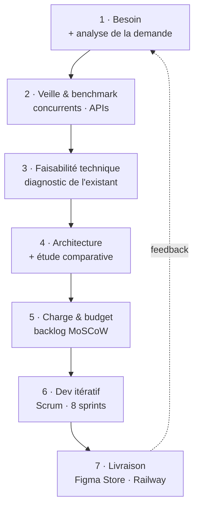
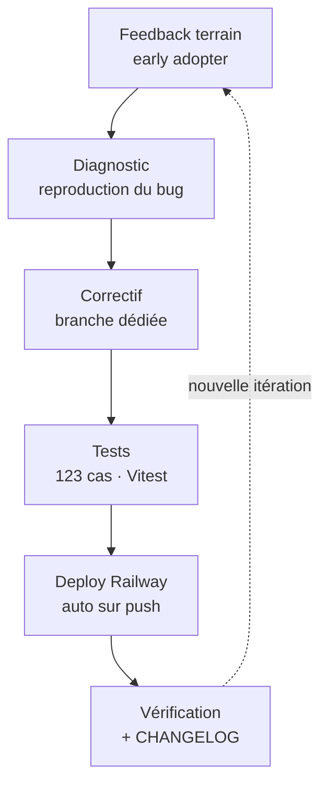
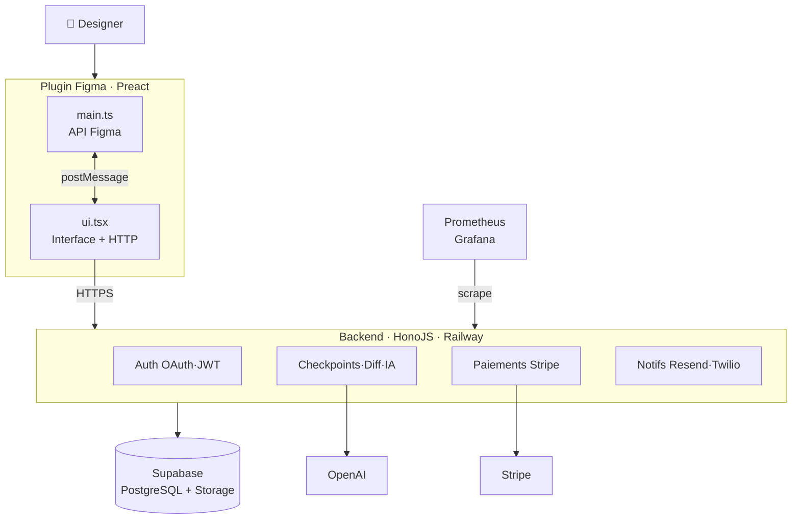

  

    
DG

    

      
Plugin Figma · Soutenance BC01 — Cadrage de projet

    

  

  <h1 class="text-6xl mb-4">Design Guardian</h1>
  

    Le contrôle de version pour les designers Figma. 
    Précision 0.01px. Attribution par élément. IA embarquée.
  

  

    
<strong style="color:#f0f9ff">Hardi Tabuna</strong> — Candidat

    
·

    
Expert en Développement Logiciel — RNCP 39583

    
·

    
Juin 2026

  

---
layout: center
---

<h1 class="text-center mb-2">Sommaire</h1>

Bloc 1 — Cadrer un projet de développement d'applications logicielles

  
01Présentation & compétences visées

  
07Démarche d'amélioration & terrain

  
02Un projet réel — pas un exercice

  
08Architecture logicielle · C1.5

  
03Cartographie des acteurs · C1.1.1

  
09Charge & budget · C1.4

  
04Processus de cadrage · C1.2.2

  
10Cartographie des risques · C1.2.3

  
05Problème identifié · C1.1.2

  
11Veille & comparatif · C1.3

  
06La solution répond au problème · C1.6

  
12Démo live

---
layout: center
---

<h1 class="text-center mb-2">Compétences du Bloc 1 — à l'identique</h1>

Cadrer un projet de développement d'applications logicielles · RNCP 39583 — chaque compétence est couverte et localisée dans la présentation

<table class="comp-table max-w-4xl mx-auto" style="font-size:0.72rem">
  <thead>
    <tr><th style="width:14%">Compétence</th><th style="width:44%">Intitulé officiel</th><th style="width:26%">Livrable attendu</th><th style="width:16%">Couvert</th></tr>
  </thead>
  <tbody>
    <tr><td><strong style="color:#67e8f9">C1.1.1</strong></td><td>Cartographier les acteurs du projet et leurs rôles</td><td>Cartographie des parties prenantes</td><td class="check">Slide 05</td></tr>
    <tr><td><strong style="color:#67e8f9">C1.1.2</strong></td><td>Analyser la demande et le besoin du commanditaire</td><td>Présentation de l'analyse de la demande</td><td class="check">Slide 07</td></tr>
    <tr><td><strong style="color:#67e8f9">C1.2.1</strong></td><td>Cartographier les opportunités et les menaces</td><td>Cartographie opportunités / menaces</td><td class="check">Risques + Comparatif</td></tr>
    <tr><td><strong style="color:#67e8f9">C1.2.2</strong></td><td>Évaluer la faisabilité technique</td><td>Démarche d'audit + diagnostic de l'existant</td><td class="check">Slide 06</td></tr>
    <tr><td><strong style="color:#67e8f9">C1.2.3</strong></td><td>Cartographier les risques techniques & fonctionnels</td><td>Cartographie des risques + référentiel + indicateurs</td><td class="check">Slide 13</td></tr>
    <tr><td><strong style="color:#67e8f9">C1.3.1</strong></td><td>Réaliser une veille technique, technologique & réglementaire</td><td>Méthodologie de veille + sources</td><td class="check">Slide 14</td></tr>
    <tr><td><strong style="color:#67e8f9">C1.3.2</strong></td><td>Sélectionner l'architecture technique (étude comparative)</td><td>Étude comparative des solutions</td><td class="check">Slide 14 + Archi</td></tr>
    <tr><td><strong style="color:#67e8f9">C1.4.1</strong></td><td>Évaluer la charge de travail</td><td>Cahier des charges fonctionnel + estimation (j-h)</td><td class="check">Slide 12</td></tr>
    <tr><td><strong style="color:#67e8f9">C1.4.2</strong></td><td>Estimer le coût du projet</td><td>Budget prévisionnel</td><td class="check">Slide 12</td></tr>
    <tr><td><strong style="color:#67e8f9">C1.5</strong></td><td>Modéliser une architecture logicielle</td><td>Schémas de l'architecture logicielle</td><td class="check">Slide 11</td></tr>
    <tr><td><strong style="color:#67e8f9">C1.6</strong></td><td>Proposer les axes de solutions au client</td><td>Préconisation + argumentaire</td><td class="check">Slide 08 + Démo</td></tr>
  </tbody>
</table>

---
layout: center
---

<h1 class="text-center mb-2">Un projet réel — pas un exercice</h1>

Design Guardian répond à un besoin concret et a déjà un utilisateur en production

  

    
Commanditaire

    
Double objectif

    
Valider le titre M2 <strong>et</strong> lancer un produit commercialisable — pas une maquette jetable.

  

  

    
En production ✅

    
Publié sur Figma Community

    
Plugin approuvé · mai 2026. Backend live sur Railway, BDD Supabase.

  

  

    
Early adopter

    
Designer pro actif

    
Designer UX/UI indépendant qui teste en conditions réelles et fait remonter du feedback terrain.

  

  Le cadrage qui suit n'est pas théorique : il est validé par un utilisateur réel et un produit en ligne.

---
layout: center
---

C1.1.1 — Cartographier les acteurs du projet

<h1 class="text-center mb-8">Cartographie des acteurs</h1>

  

    
Gérer de près — Q1

    

      
Jury M2 — valide RNCP 39583 · oral juin 2026

      
Early adopter ✅ — designer UX/UI indépendant · actif mai 2026

    

  

  

    
Satisfaire — Q2

    

      
Commanditaire formation — livrables BC01–BC04

      
Figma Platform — Plugin Store · approuvé mai 2026 ✅

      
Figma Branches — concurrent à 45 $/mois/user

    

  

  

    
Informer — Q4

    

      
UX / Packaging Designers — utilisateurs finaux

      
Communauté Figma — découverte via Plugin Store

    

  

  

    
Surveiller — Q3

    

      
OpenAI — API GPT-4o-mini · quotas

      
Railway / Supabase — infrastructure hébergement

    

  

  ✦ Early adopter actif — designer professionnel avec sa propre entreprise · feedback terrain CHECK_04 intégré dans le produit

---
layout: two-cols
---

C1.2.2 — Faisabilité & processus

<h1>Processus de cadrage</h1>

Du besoin au produit en ligne — une démarche itérative documentée

::right::

  

    
Démarche d'audit de l'existant

    
Diagnostic des solutions en place : Figma Version History, Figma Branches (Organization), Abstract. Constat : aucune granularité géométrique ni attribution par élément.

  

  

    
Contraintes identifiées

    
Double thread Figma · limite CPU Workers · budget infra ≈ 0 € · solo dev · délais M2.

  

  

    
Décision de lancement

    
Stack validée : Preact + HonoJS + Supabase + Railway. Faisabilité confirmée, MVP cadré.

  

---
layout: center
---

C1.1.2 — Analyse de la demande

<h1 class="text-center mb-2">Le problème identifié</h1>

Figma sait <em>que</em> tu as sauvegardé. Il ne sait pas <em>quoi</em>, <em>où</em>, ni <em>pourquoi</em>.

  

    
Figma Version History

    
Capture des snapshots visuels. Impossible de savoir <strong>quel élément</strong> a changé ni de quel montant.

  

  

    
Attribution fantôme

    
Dans un fichier partagé à 5 designers, <strong>impossible</strong> de savoir qui a modifié quoi et quand.

  

  

    
Figma Branches = 45€/mois/user

    
Réservé au plan Organization. Inaccessible pour les <strong>freelances et petites équipes</strong>.

  

---
layout: center
---

C1.6 — Axes de solution préconisés

<h1 class="text-center mb-8">La solution répond au problème</h1>

  

    
Diff géométrique 0.01px

    
→ « quel élément » · comparaison nœud par nœud via les propriétés natives Figma

  

  

    
Attribution par élément

    
→ « qui & quand » · figma.currentUser sur chaque checkpoint

  

  

    
AI Patch Notes (GPT-4o-mini)

    
→ « pourquoi » · le produit IA vendu : changelog en langage naturel à chaque checkpoint

  

  

    
Branches de design — Free

    
→ vs 45€/mois · workflow Git-like : main, feat/redesign, fix/nav

  

  

    
Restauration sur canvas

    
Apply to Figma — restaure une version directement dans le fichier

  

  

    
Modèle Free / Pro 12€ / Team 39€

    
Freemium via Stripe — rentable dès 1 abonnement Pro

  

---
layout: two-cols
---

Démarche d'amélioration continue

<h1>Du feedback au correctif</h1>

Le cycle déclenché par l'usage réel de l'early adopter

::right::

  

    
24

    
commits en une session de fiabilisation

  

  

    
Exemples résolus en condition réelle

    

      • Isolation des checkpoints par branche
      • Clé de fichier partagée multi-designers
      • Restauration exhaustive (police + couleur)
      • Mode Différence pour les changements sur place
    

  

  

    
Chaque anomalie est <strong style="color:#e5e7eb">consignée, corrigée, testée, déployée et tracée</strong> au CHANGELOG — boucle BC04 illustrée en direct.

  

---
layout: center
---

<h1 class="text-center mb-8">Témoignage — early adopter</h1>

  
“

  

    [ Citation à compléter — phrase exacte de l'early adopter sur ce que Design Guardian
    lui apporte dans son workflow réel : précision du diff, attribution, gain de temps… ]
  

  

    
★

    

      
[ Prénom / Nom ou initiales ]

      
Designer UX/UI indépendant · early adopter · mai 2026

    

  

À remplacer par la citation réelle avant l'oral — encadré prêt à l'emploi.

---
layout: two-cols
---

C1.5 — Modélisation de l'architecture logicielle

<h1>Architecture</h1>

6 microservices · Plugin Figma · Supabase · Railway

<a class="open-diagram" href="/architecture.html" target="_blank">
  🔍 Explorer en interactif →
</a>

::right::

  

    
Double thread Figma

    
<strong>main.ts</strong> : API Figma uniquement (absoluteTransform, fills, vectorPaths) <strong>ui.tsx</strong> : interface + appels HTTPS

  

  

    
Diff engine

    
Propriétés natives Figma → DeltaJSON. Tolérance ε = 0.01px. Pas de parsing SVG.

  

  

    
6 microservices

    
Auth · BDD · Métriques · Notifications · IA · Paiements. Snapshots JSON → Storage, métadonnées → PostgreSQL (CTE récursifs pour l'arbre de branches).

  

---
layout: two-cols
---

C1.4 — Charge & coût

<h1>Planning & Budget</h1>

8 sprints · Oct 2024 → Juin 2026

  

    S0–S2
    Cadrage · fondations · plugin MVP (Oct – Déc 2024)
  

  

    S3–S4
    Diff engine · IA · Diff Viewer (Jan – Mar 2025)
  

  

    S5–S6
    Branches · Gold status · CI/CD · Monitoring (Mar – Juin 2025)
  

  

    S7–S8
    Storage migration · Figma Store ✅ · Soutenance (Avr – Juin 2026)
  

  

    🏆 Approuvé Figma Community · mai 2026 · Early adopter actif
  

::right::

  
Budget prévisionnel MVP

  

    

      Développement (solo, ~3,5 mois · ~2 j/sem)
      ~30 j-h (~240h)
    

    

      Railway (hébergement backend)
      0 €/mois
    

    

      Supabase (BDD + Storage)
      0 €/mois
    

    

      OpenAI (GPT-4o-mini)
      ~1 € / 1 000 checkpoints
    

    

      Resend + Twilio
      free tier
    

    

      Coût infra mensuel
      0 €/mois
    

  

  

    
Rentable dès <strong style="color:#e5e7eb">1 abonnement Pro</strong> (12 €/mois) · ROI immédiat

  

---
layout: center
---

C1.2.3 — Cartographie des risques

<h1 class="text-center mb-6">Cartographie des risques</h1>

  

    

      
      R01 — Feature native Figma
    

    
Figma sort un versioning natif concurrent

    
→ DG = Free · Branches = 45$/mois · diff 0.01px · AI

  

  

    

      
      R02 — Rupture API Plugin
    

    
Figma modifie / supprime l'API Plugin

    
→ APIs stables uniquement · surveillance changelog Figma

  

  

    

      
      R03 — Adoption faible
    

    
Faible traction au lancement

    
→ Early adopter actif · Plugin Store public · Free tier

  

  

    

      
      R06 — Quota OpenAI
    

    
Dépassement quota / coût IA incontrôlé

    
→ Rate limiting backend · fallback <code>null</code> si quota atteint

  

  
9 risques matérialisés et résolus en cours de projet

  
figma.mixed non sérialisable · data URI trop large · Zod stripping silencieux · branches sans isolation réelle · Storage migration · fileKey null inter-utilisateurs · Plugin Store refus → tous documentés dans CHANGELOG

---
layout: center
---

C1.3 — Veille & étude comparative des solutions

<h1 class="text-center mb-8">Veille & comparatif concurrents</h1>

<table class="comp-table max-w-3xl mx-auto">
  <thead>
    <tr>
      <th>Fonctionnalité</th>
      <th>Design Guardian</th>
      <th>Figma Version History</th>
      <th>Figma Branches</th>
      <th>Abstract</th>
    </tr>
  </thead>
  <tbody>
    <tr>
      <td>Diff géométrique précis</td>
      <td class="check">✓ 0.01px</td>
      <td class="cross">✗</td>
      <td class="cross">✗</td>
      <td class="partial">~ visuel seulement</td>
    </tr>
    <tr>
      <td>Attribution par élément</td>
      <td class="check">✓</td>
      <td class="cross">✗</td>
      <td class="partial">~ par fichier</td>
      <td class="partial">~ par commit</td>
    </tr>
    <tr>
      <td>AI Patch Notes</td>
      <td class="check">✓ GPT-4o-mini</td>
      <td class="cross">✗</td>
      <td class="cross">✗</td>
      <td class="cross">✗</td>
    </tr>
    <tr>
      <td>Branches</td>
      <td class="check">✓ Free</td>
      <td class="cross">✗</td>
      <td class="partial">45€/mois/user</td>
      <td class="check">✓ payant</td>
    </tr>
    <tr>
      <td>Plugin natif Figma</td>
      <td class="check">✓</td>
      <td class="check">✓ intégré</td>
      <td class="check">✓ intégré</td>
      <td class="cross">✗ app externe</td>
    </tr>
    <tr>
      <td>Restauration canvas</td>
      <td class="check">✓ Apply to Figma</td>
      <td class="partial">~ snapshot visuel</td>
      <td class="check">✓</td>
      <td class="cross">✗</td>
    </tr>
    <tr>
      <td>Prix d'entrée</td>
      <td class="check">Gratuit</td>
      <td class="check">Inclus Figma</td>
      <td class="cross">45€/mois</td>
      <td class="cross">29€/mois</td>
    </tr>
  </tbody>
</table>

---
layout: center
---

  
DG

  <h1 class="text-5xl text-center" style="-webkit-text-fill-color: white; background: none">Démo live</h1>
  
Ouvrons Figma.

  

    
Capture d'un checkpoint

    
AI Patch Note généré

    
Diff Split / Overlay

  

  
design-guardian.up.railway.app

